# Amphi 3 - Useful libraries in Python for Numeric Computation and Data Processing

# 1. random

## 1.1 Randomness on integers

The library **random** can be used to generate some random variables. Example:

**Return a randomly selected element from a range**


```python
import random
print("Generate a random integer between 4, 9")
for i in range(5):
    print(random.randrange(4, 10))
print("Generate a random pair integer between 4, 8")
for i in range(5):
    print(random.randrange(4, 10, 2))
print("Generate a random integer between 4, 9")
for i in range(5):
    print(random.randint(4, 9))
```

    Generate a random integer between 4, 9
    9
    4
    4
    7
    8
    Generate a random pair integer between 4, 8
    8
    6
    6
    6
    8
    Generate a random integer between 4, 9
    4
    6
    5
    9
    4
    

**Shuffle a list**


```python
L = range(10)
print(L)
random.shuffle(L)
print(L)
```

    [0, 1, 2, 3, 4, 5, 6, 7, 8, 9]
    [4, 3, 9, 6, 2, 5, 8, 1, 0, 7]
    

**Sampling a model**


```python
L = random.sample(range(1000), 20)
print(L)
L = random.sample(range(20), 20)
print(L)
```

    [330, 243, 305, 879, 135, 633, 524, 603, 480, 515, 781, 922, 751, 757, 226, 453, 365, 761, 280, 888]
    [16, 8, 3, 7, 2, 13, 1, 19, 15, 17, 10, 12, 0, 5, 11, 4, 14, 18, 6, 9]
    

## 1.2 Randomness on real numbers

**Generate a random real number in the range [0, 1)**


```python
for i in range(5):
    print(random.random())
```

    0.73450299257
    0.782709190326
    0.0678813876462
    0.847162035563
    0.17915752427
    

**Generate a random real number uniformly in [a, b]**


```python
for i in range(5):
    print(random.uniform(0, 5))
```

    2.91045869101
    3.55954335235
    2.09429499781
    1.02807183262
    3.12522930303
    

**Generate a random real number following Gaussian distribution**


```python
for i in range(5):
    print(random.gauss(0, 1))
```

    -0.0292818909131
    0.791454635633
    -0.419791763843
    -2.22804725722
    -0.588239115119
    

## 1.3 seed

seed is an internal state of the random number generator. When we fix a seed, the $n^{th}$ called of the same random function will always return the same value.


```python
random.seed("ABC")
for i in range(5):
    print(random.randint(2, 4))
    print(random.gauss(0, 1))
#print(random.getstate())
```

    4
    0.536666662286
    2
    1.18434016652
    2
    0.0910960813855
    3
    0.26537243757
    4
    -0.810808406888
    4
    0.536666662286
    2
    1.18434016652
    2
    0.0910960813855
    3
    0.26537243757
    4
    -0.810808406888
    

# 2. numpy

## 2.1 numpy array (numpy.ndarray)

A numpy ndarray (numpy array) can represent a list of list of list ... of numbers or str.
It implements methods for basic operation on vectors and matrices, hence usually used in linear algebra problems.

A numpy array composed of a list or tuple of $k$ numbers or str is said of **ndim** 1 and of **shape** ($k$). In this case we say that the list or tuple is also of **ndim** 1 and **shape** ($k$).


```python
import numpy as np
A = np.array([1, 2, 3])
print(A)
print(A.ndim)
print(A.shape)
print(type(A))
```

    [1 2 3]
    1
    (3L,)
    <type 'numpy.ndarray'>
    

Recursively, a numpy array composed of a list/tuple/numpy array of $k$ lists/tuples/numpy arrays, each of which is of **ndim** $n-1$ and **shape** ($k_1, k_2, \ldots, k_{n-1}$) is said to be of **ndim** $n$ and **shape** ($k, k_1, k_2, \ldots, k_{n-1}$).


```python
B = np.array([ [1, 2, 3], [3, 4, 5] ])
print(B)
print(B.ndim)
print(B.shape)
```

    [[1 2 3]
     [3 4 5]]
    2
    (2L, 3L)
    


```python
C = np.array([[[1, 2, 3]]])
print(C)
print(C.ndim)
print(C.shape)
```

    [[[1 2 3]]]
    3
    (1L, 1L, 3L)
    

By convention, a scalar (number of string) can also form a numpy array. Its **ndim** is 0 and its **shape** is ().


```python
N = np.array(1)
print(N.ndim)
print(N.shape)
```

    0
    ()
    

We can use numpy arrays of **ndim** 1 to represent vectors and numpy arrays of **ndum** 2 to represent matrices.

We can access and modify elements in a numpy array. Numpy arrays are mutable.


```python
B = np.array([[1, 2, 3], [3, 4, 5]])
print("Get the first row")
print(B[0])
print("Get the first element of the first row")
print(B[0, 0]) #instead of B[0][0]
print("Get the second column")
print(B[:, 1])
print("Modify the second column to 100, 200")
B[:, 1] = [100, 200]
print("The array after modification")
print(B)
```

    Get the first row
    [1 2 3]
    Get the first element of the first row
    1
    Get the second column
    [2 4]
    Modify the second column to 100, 200
    The array after modification
    [[  1 100   3]
     [  3 200   5]]
    

We can also access elements of arrays using list.


```python
A = np.array([0, 1, 2, 3, 4, 5, 6, 7, 8, 9])
B = A**2
print(B)
print(B[ [1, 3, 5, 7, 9] ])

#A = np.array([[1, 2], [3, 4]])
#print(A[[0, 1]] )
#print(A[[0, 1], [1, 1]] ) #print(A[[0, 1], 1] )
```

    [ 0  1  4  9 16 25 36 49 64 81]
    [ 1  9 25 49 81]
    

## 2.2 Operations on numpy arrays of the same shape

If two numpy arrays are of the same shape, their operations are elementwise.


```python
B = np.array([[1, 2, 3], [3, 4, 5]])
D = np.array([[2, -1, 1], [2, -0, 3]])
print("B")
print(B)
print("D")
print(D)
print("B + D = ")
print(B + D)
print("B - D = ")
print(B - D)
print("B * D = ")
print(B * D)
print("sin(B) = ")
print(np.sin(B))
```

    B
    [[1 2 3]
     [3 4 5]]
    D
    [[ 2 -1  1]
     [ 2  0  3]]
    B + D = 
    [[3 1 4]
     [5 4 8]]
    B - D = 
    [[-1  3  2]
     [ 1  4  2]]
    B * D = 
    [[ 2 -2  3]
     [ 6  0 15]]
    sin(B) = 
    [[ 0.84147098  0.90929743  0.14112001]
     [ 0.14112001 -0.7568025  -0.95892427]]
    

## 2.3 Broadcasting in numpy arrays


```python
A = np.array([[1, 2, 3], [4, 5, 6]])
B = np.array([1, 2, 3])
A - B
```


    array([[0, 0, 0],
           [3, 3, 3]])


Binary operations between a numpy array and a list or tuple of the same shape can be performed. Lists, tuples will be broadcasted into numpy arrays.


```python
A = np.array([[1, 2, 3], [4, 5, 6]])
B = [(1, 2, 3), [4, 5, 6]]
A + B
```


    array([[ 2,  4,  6],
           [ 8, 10, 12]])


If the arrays are not compatible in shape, binary operations cannot be applied. (the notion "compatibility in shape" will be described below)


```python
A = np.array([[1, 2], [3, 4]])
B = np.array([[1, 2, 3], [3, 4, 6]])
print(A.shape)
print(B.shape)
try:
    print(A + B)
except Exception as e:
    print(e)
```

    (2L, 2L)
    (2L, 3L)
    operands could not be broadcast together with shapes (2,2) (2,3) 
    

Two arrays $A$ of shape $(a_{d_A}, \ldots,a_2, a_1)$ and $B$ of shape $(b_{d_B}, \ldots, b_2, b_1)$ are compatible in shape if $a_i = b_i$ or $a_i = 1$ or $b_i = 1$ for all $i = 1, \ldots, \min(d_A, d_B)$.

Examples of compatible-in-shape numpy-arrays:
A      (2d array):  5 x 4
B      (1d array):      1
Result (2d array):  5 x 4

A      (2d array):  5 x 4
B      (1d array):      4
Result (2d array):  5 x 4

A      (3d array):  15 x 3 x 5
B      (3d array):  15 x 1 x 5
Result (3d array):  15 x 3 x 5

A      (3d array):  15 x 3 x 5
B      (2d array):       3 x 5
Result (3d array):  15 x 3 x 5

A      (3d array):  15 x 3 x 5
B      (2d array):       3 x 1
Result (3d array):  15 x 3 x 5
Operations on compatible-in-shape numpy-arrays can be performed by duplicating every lists at level $i$ to $b_i$ copies where $a_i = 1$ or $i < \min(d_A, d_B)$ and vice versa.


```python
A = np.array([1, 2])
#A = np.array([[1], [2]]) #add column
B = np.array([[1, 2], [3, 4]])
print(A.shape)
print(B.shape)
print("---------Method1---------")
print(A + B)
print("---------Method2---------")
AA = np.array([[1, 1], [1, 1]])
print(AA + B)
print("---------Method3---------")
print(1 + B)
```

    (2L,)
    (2L, 2L)
    ---------Method1---------
    [[2 4]
     [4 6]]
    ---------Method2---------
    [[2 3]
     [4 5]]
    ---------Method3---------
    [[2 3]
     [4 5]]
    

## 2.4. numpy.dot

The method **dot** in numpy is constructed to compute matrix multiplication and vector dot product. Do not consider it as a binary operation (do not apply it pointwisely).

If $A$ is of shape $(a_{d_A}, \ldots,a_2, a_1)$ and $B$ of shape $(b_{d_B}, \ldots, b_2, b_1)$, then **numpy.dot(A, B)** is defined if 
- $a_1 = b_2$
- or $d_B = 1$ and $a_1 = b_1$

In the first case, **numpy.dot(A, B)** is an array $C$ of shape $(a_{d_A}, \ldots, a_3, a_2, b_{d_B}, b_3, b_1)$, and:
$$
C[\dots, i, \ldots, j] = \sum(  A[\ldots, i, :] * B[ \ldots, :, j] )
$$


```python
A = np.array([ [[1, 2, 3], [4, 5, 6]], [[0, 2, 0], [1, 0, 2]] ])
#print(A)
print(A.shape)
B = np.array([ [[1, 2], [2, 3], [3, 2]], [[1, 1], [1, 2], [2, 1]], [[2, 1], [0, 2], [1, 0]] ])
#print(B)
print(B.shape)
C = np.dot(A, B)
print("Shape of A*B")
print(C.shape)

#print(C)
#print(C[0,0,0,0])
#print(sum(A[0,0,:] * B[0,:,0]))
```

    (2L, 2L, 3L)
    (3L, 3L, 2L)
    Shape of A*B
    (2L, 2L, 3L, 2L)
    

In the second case, **numpy.dot(A, B)** is an array $C$ of shape $(a_{d_A}, \ldots, a_3, a_2)$, and:
$$
C[\dots, i, j] = \sum(  A[\ldots, i, :] * B )
$$


```python
A = np.array([ [[1, 2, 3], [4, 5, 6]], [[0, 2, 0], [1, 0, 2]] ])
B = [1, 2, 3]
print(A)
print(B)
print("A.B = ")
print(A.dot(B))
```

    [[[1 2 3]
      [4 5 6]]
    
     [[0 2 0]
      [1 0 2]]]
    [1, 2, 3]
    A.B = 
    [[14 32]
     [ 4  7]]
    

Corollary:
- If $A, B$ are vectors: **numpy.dot** returns the dot product
- If $A$ is matrix, $B$ is vector, it returns $AB$.
- If $A, B$ are matrices, it returns $AB$.
- If $A$ is vector, $B$ is matrix, it returns $A^t B$.


```python
A = np.array([[1, 2, 3], [4, 5, 6]])
print(A)
B = np.array([[2, 3], [1, 2], [2, 2]])
print(B)
v = np.array([1, 2, 5])
print("Matrix dot matrix")
print(A.dot(B))
print("Matrix dot vector")
print(A.dot(v))
print("Vector dot vector")
print(v.dot(v))
print("Vector dot matrix")
print(v.dot(B))
```

    [[1 2 3]
     [4 5 6]]
    [[2 3]
     [1 2]
     [2 2]]
    Matrix dot matrix
    [[10 13]
     [25 34]]
    Matrix dot vector
    [20 44]
    Vector dot vector
    30
    Vector dot matrix
    [14 17]
    

If we want to compute $vv^t$, where $v$ is a vector?


```python
v = np.array([1, 2, 5])
print(v.reshape(3,1).dot(v.reshape(1, 3)))
```

    [[ 1  2  5]
     [ 2  4 10]
     [ 5 10 25]]
    

## 2.5. Linear Algebra: Vectors and Matrices

**Zero vector**


```python
O = np.zeros(3)
O
```


    array([ 0.,  0.,  0.])


**Zero matrices**


```python
O = np.zeros((3, 4))
O
```


    array([[ 0.,  0.,  0.,  0.],
           [ 0.,  0.,  0.,  0.],
           [ 0.,  0.,  0.,  0.]])


**Identity matrix**


```python
I = np.eye(5)
4 * I
```


    array([[ 4.,  0.,  0.,  0.,  0.],
           [ 0.,  4.,  0.,  0.,  0.],
           [ 0.,  0.,  4.,  0.,  0.],
           [ 0.,  0.,  0.,  4.,  0.],
           [ 0.,  0.,  0.,  0.,  4.]])


**Diagonal matrix**


```python
D = np.diag([2, 3, 4, 5])
D
```


    array([[2, 0, 0, 0],
           [0, 3, 0, 0],
           [0, 0, 4, 0],
           [0, 0, 0, 5]])


**Transpose**


```python
A = np.array([[1, 2], [3, 4]])
#A.transpose()
A.T
```


    array([[1, 3],
           [2, 4]])


**Inverse**


```python
A = np.array([[1, 2], [3, 4]])
np.linalg.inv(A)
```


    array([[-2. ,  1. ],
           [ 1.5, -0.5]])


**Determinant**


```python
A = np.array([[1, 2], [3, 4]])
np.linalg.det(A)
```


    -2.0000000000000004


**SVD**


```python
A = np.array([[1, 2], [3, 4]]) # A (mxn) = U (mxm) * S(mxn) * V^T (nxn)
U, S, V = np.linalg.svd(A)
U, S, V
```


    (array([[-0.40455358, -0.9145143 ],
            [-0.9145143 ,  0.40455358]]),
     array([ 5.4649857 ,  0.36596619]),
     array([[-0.57604844, -0.81741556],
            [ 0.81741556, -0.57604844]]))


**Diagonalisation**


```python
A = np.array([[1, 2], [3, 4]])
Eigs = np.linalg.eig(A)
print(Eigs)
print(A.dot(Eigs[1][:,0]) - Eigs[0][0]*Eigs[1][:,0])
print(A.dot(Eigs[1]) - Eigs[0]*Eigs[1])
```

    (array([-0.37228132,  5.37228132]), array([[-0.82456484, -0.41597356],
           [ 0.56576746, -0.90937671]]))
    [  0.00000000e+00   5.55111512e-17]
    [[  0.00000000e+00   0.00000000e+00]
     [  5.55111512e-17   0.00000000e+00]]
    

## 2.6 numpy.matrix

If we are interested in matrices (numpy-array of **ndim** 2 only), we can use **numpy.matrix**. **numpy.matrix** is a subclass of **numpy.array**, hence inherits attributes and methods of numpy-arrays.

Using **numpy.matrix** the **\*** operation performs matrix multiplication (not elementwise multiplication). 


```python
M = np.matrix("1 2.5; 3 0.5")
N = np.matrix([[-1, 2], [0, -1]])
print(M)
print(N)
print(type(M), type(N))
print(M*N)
print(2*M)
```

    [[ 1.   2.5]
     [ 3.   0.5]]
    [[-1  2]
     [ 0 -1]]
    (<class 'numpy.matrixlib.defmatrix.matrix'>, <class 'numpy.matrixlib.defmatrix.matrix'>)
    [[-1.  -0.5]
     [-3.   5.5]]
    [[ 2.  5.]
     [ 6.  1.]]
    

Operations between a matrix and an array return a matrix.


```python
M = np.matrix("1 2.5; 3 0.5")
N = np.array([[-1, 2], [0, -1]])
print(type(M), type(N))
print(M*N)
print(type(M*N))
```

    (<class 'numpy.matrixlib.defmatrix.matrix'>, <type 'numpy.ndarray'>)
    [[-1.  -0.5]
     [-3.   5.5]]
    <class 'numpy.matrixlib.defmatrix.matrix'>
    

**Operations on matrices**


```python
M = np.matrix("1 2.5; 3 0.5")
print("Inverse")
print(np.linalg.inv(M))
print("SVD")
print(np.linalg.svd(M))
print("Diagonalization")
print(np.linalg.eig(M))
```

    Inverse
    [[-0.07142857  0.35714286]
     [ 0.42857143 -0.14285714]]
    SVD
    (matrix([[-0.62087063, -0.78391305],
            [-0.78391305,  0.62087063]]), array([ 3.55190967,  1.97077084]), matrix([[-0.83690466, -0.54734869],
            [ 0.54734869, -0.83690466]]))
    Diagonalization
    (array([ 3.5, -2. ]), matrix([[ 0.70710678, -0.6401844 ],
            [ 0.70710678,  0.76822128]]))
    

**Attention:** If we want to multiply a numpy.matrix with a vector, the vector must be represented as a matrix or must be reshaped. The result is a numpy.matrix.


```python
M = np.matrix("1 2.5; 3 0.5")
v = np.array([1, 2])
#M*v
v = v.reshape(2, 1)
print(M*v)
```

    [[ 6.]
     [ 4.]]
    

## 2.7 Other options

We can get a uniform partition on any $[a, b]$ segment by using **arange** or **linspace** methods. **arange** requires the mesh  (length of each subinterval) while **linspace** requires the number of points as an argument.

Attention: **arange(a, b, something)** does not contains **b**, while **linspace** does.


```python
a = np.arange(1, 5, 0.1)
print(a)
```

    [ 1.   1.1  1.2  1.3  1.4  1.5  1.6  1.7  1.8  1.9  2.   2.1  2.2  2.3  2.4
      2.5  2.6  2.7  2.8  2.9  3.   3.1  3.2  3.3  3.4  3.5  3.6  3.7  3.8  3.9
      4.   4.1  4.2  4.3  4.4  4.5  4.6  4.7  4.8  4.9]
    


```python
b = np.linspace(1, 5, 41)
print(b)
```

    [ 1.   1.1  1.2  1.3  1.4  1.5  1.6  1.7  1.8  1.9  2.   2.1  2.2  2.3  2.4
      2.5  2.6  2.7  2.8  2.9  3.   3.1  3.2  3.3  3.4  3.5  3.6  3.7  3.8  3.9
      4.   4.1  4.2  4.3  4.4  4.5  4.6  4.7  4.8  4.9  5. ]
    

We can reshape an array using **reshape** method.


```python
A = np.array(range(1, 101))
print("Reshape to matrix 10x10")
B = A.reshape(10, 10)
print(B)
print("Reshape to 3d array 2x5x10")
C = A.reshape(2, 5, 10)
print(C)
```

    Reshape to matrix 10x10
    [[  1   2   3   4   5   6   7   8   9  10]
     [ 11  12  13  14  15  16  17  18  19  20]
     [ 21  22  23  24  25  26  27  28  29  30]
     [ 31  32  33  34  35  36  37  38  39  40]
     [ 41  42  43  44  45  46  47  48  49  50]
     [ 51  52  53  54  55  56  57  58  59  60]
     [ 61  62  63  64  65  66  67  68  69  70]
     [ 71  72  73  74  75  76  77  78  79  80]
     [ 81  82  83  84  85  86  87  88  89  90]
     [ 91  92  93  94  95  96  97  98  99 100]]
    Reshape to 3d array 2x5x10
    [[[  1   2   3   4   5   6   7   8   9  10]
      [ 11  12  13  14  15  16  17  18  19  20]
      [ 21  22  23  24  25  26  27  28  29  30]
      [ 31  32  33  34  35  36  37  38  39  40]
      [ 41  42  43  44  45  46  47  48  49  50]]
    
     [[ 51  52  53  54  55  56  57  58  59  60]
      [ 61  62  63  64  65  66  67  68  69  70]
      [ 71  72  73  74  75  76  77  78  79  80]
      [ 81  82  83  84  85  86  87  88  89  90]
      [ 91  92  93  94  95  96  97  98  99 100]]]
    

**flatten** is used to reshape nd-arrays to 1d-array.


```python
A = np.array(range(1, 101))
B = A.reshape(10, 10)
print(B.flatten()) #B.reshape(100)
```

    [  1   2   3   4   5   6   7   8   9  10  11  12  13  14  15  16  17  18
      19  20  21  22  23  24  25  26  27  28  29  30  31  32  33  34  35  36
      37  38  39  40  41  42  43  44  45  46  47  48  49  50  51  52  53  54
      55  56  57  58  59  60  61  62  63  64  65  66  67  68  69  70  71  72
      73  74  75  76  77  78  79  80  81  82  83  84  85  86  87  88  89  90
      91  92  93  94  95  96  97  98  99 100]
    

We can combine ndarrays horizontally or vertically by **vstack** and **hstack**.


```python
A = np.array([[1, 2], [3, 4]])
B = np.array([[5, 6], [7, 8]])
print(np.vstack((A, B)))
print(np.hstack((A, B)))
```

    [[1 2]
     [3 4]
     [5 6]
     [7 8]]
    [[1 2 5 6]
     [3 4 7 8]]
    

**numpy** supports basic functions in analysis and trigonometry. Instead of importing **math**, we can import **numpy**.


```python
np.sin(np.pi/2), np.log(20)
```


    (1.0, 2.9957322735539909)


# 3. scipy

## 3.1 scipy.special

Lots of famous functions in mathematics are defined in **scipy.special**. Check <a href="https://docs.scipy.org/doc/scipy/reference/special.html#module-scipy.special"> this link</a> to scan these functions.

Here are some examples:

**Gamma function**
$$
\Gamma(z) = \int_0^{+\infty} t^{z-1}e^{-t} dt
$$


```python
import scipy.special as sp
```


```python
sp.gamma(4), sp.gamma(2), sp.gamma(6)
```


    (6.0, 1.0, 120.0)


**Beta function**
$$
B(x, y) = t^x(1-t)^{y-1}dt = \frac{\Gamma(x) \Gamma(y)}{\Gamma(x+y)}
$$


```python
sp.beta(2, 4)
```


    0.050000000000000003


**Error function**
$$
erf(x) =\frac2{\sqrt{\pi}} \int_0^x e^{-t^2} dt
$$


```python
sp.erf(-1000), sp.erf(0), sp.erf(1), sp.erf(1000)
```


    (-1.0, 0.0, 0.84270079294971478, 1.0)


## 3.2 scipy.integrate


```python
import scipy.integrate as integrate
```

**scipy** supports simple, double and triple integration by **quad**, **dblquad** and **tplquad** methods.

Examples:
$$
\int_{0}^5 x dx
$$


```python
integrate.quad(lambda x: x, 0, 5)
```


    (12.5, 1.3877787807814457e-13)


$$
\int_0^2 \int_0^3 dy dx
$$


```python
integrate.dblquad(lambda y, x: 1, 0, 2, lambda y: 0, lambda y: 3)
```


    (6.0, 6.661338147750939e-14)


The "infinity" quantity can be translated into **np.inf** in **numpy**.

$$
\int_0^{+\infty} \int_1^{+\infty} \frac{e^{-xt}}{t^n} dt dx = \frac1n
$$

Attention: In function declaration: declare $t$ first. In boundary declaration: declare endpoints of $x$ first.


```python
n = 3
integrate.dblquad(lambda t, x: np.exp(-x*t)/(t**2), 0, np.inf, lambda t: 1, lambda t: np.inf)
```


    (0.499999999909358, 1.4640839512484866e-08)


$$
\int_0^{1/2}\int_0^{1-2y} xy dx dy = \frac1{96}
$$


```python
integrate.dblquad(lambda x, y: x*y, 0, 0.5, lambda y:0, lambda y: 1 - 2*y)
```


    (0.010416666666666668, 1.1564823173178715e-16)


**Triple integration**
$$
\int_0^1 \int_0^\pi \int_0^{2\pi} r^2 \sin\theta d\phi d\theta dr = \frac43 \pi
$$


```python
V = integrate.tplquad(lambda phi, theta, r: r**2 * np.sin(theta), 0, 1, \
                      lambda r: 0, lambda r: np.pi, lambda r, theta: 0, lambda r, theta: 2*np.pi)
print(V)
V[0]/np.pi
```

    (4.18879020478639, 4.650491330678174e-14)
    


    1.333333333333333


**n-tuple inttegration**

$$
\int_0^4 \int_0^3 \int_0^2 \int_0^1 xyzt dt dz dy dx
$$


```python
integrate.nquad(lambda t, z, y, x: x*y*z*t, [[0, 1], [0, 2], [0, 3], [0, 4]])
```


    (35.99999999999999, 3.9968028886505625e-13)


$$
\int_0^4 \int_0^3 \int_0^2 \int_0^z xyzt dt dz dy dx
$$


```python
bound_x = [0, 4]
bound_y = lambda x: [0, 3]
bound_z = lambda x, y: [0, 2]
bound_t = lambda x, y, z: [0, z]
integrate.nquad(lambda t, z, y, x: x*y*z*t, [bound_t, bound_z, bound_y, bound_x])
```


    (288.0, 3.197442310920451e-12)


## 3.3 scipy.optimize

**scipy.optimize.minimize** is implemented to solve the following problem:
$$
\min f(x)
$$
subject to
$$
g_i(x) \geq 0, i = 1, \ldots, m
$$
$$
h_j(x) = 0, j = 1, \ldots, p
$$

### Unconstrained minimization problems

Lots of algorithms have been implemented in **scipy.optimize** to help finding local extrema of functions.


```python
from scipy.optimize import minimize

def f(X):
    x, y, z = X[0], X[1], X[2]
    return x**2 + (y - 1)**2 + (z - 2)**2

res = minimize(f, (10, 0, 0), method='nelder-mead')
#print(res)
#print(res.x)
print(map(lambda x: round(x, 4), res.x))
```

    [-0.0, 1.0, 2.0]
    

**Attention**: It is a local minimum only.


```python
def f(x):
    return np.sin(x) 

res = minimize(f, 1.5, method='nelder-mead')
print(res.x)
res = minimize(f, -10, method='nelder-mead')
print(res.x)
#print(res.x)
#print(map(lambda x: round(x, 4), res.x))
```

    [-1.5708252]
    [-7.85400391]
    

The attributes **success** and **message** tells us if the algorithm is successful.


```python
def f(x):
    return x**3

res = minimize(f, 1.5, method='nelder-mead')
#print(res.x)
print(res)
```

     final_simplex: (array([[ -9.50737950e+28],
           [ -4.75368975e+28]]), array([ -8.59374553e+86,  -1.07421819e+86]))
               fun: -8.593745525161155e+86
           message: 'Maximum number of function evaluations has been exceeded.'
              nfev: 200
               nit: 100
            status: 1
           success: False
                 x: array([ -9.50737950e+28])
    

Compute the derivative helps the algorithms perform better.


```python
from scipy.optimize import minimize

def f(X):
    x, y, z = X[0], X[1], X[2]
    return x**2 + (y - 1)**2 + (z - 2)**2

def df(X):
    x, y, z = X[0], X[1], X[2]
    return np.array([2*x, 2*(y-1), 2*(z-2)])
    
res = minimize(f, (10, 0, 0), jac=df, method='nelder-mead')
print(res)
#print(res.x)
#print(map(lambda x: round(x, 4), res.x))
```

     final_simplex: (array([[ -2.99574681e-05,   1.00002458e+00,   1.99995674e+00],
           [  6.10756697e-06,   1.00007518e+00,   1.99999499e+00],
           [ -9.15711344e-06,   9.99930020e-01,   1.99996973e+00],
           [ -7.91509640e-05,   9.99933173e-01,   2.00000977e+00]]), array([  3.37334837e-09,   5.71444736e-09,   5.89706185e-09,
             1.08260635e-08]))
               fun: 3.3733483697327058e-09
           message: 'Optimization terminated successfully.'
              nfev: 442
               nit: 249
            status: 0
           success: True
                 x: array([ -2.99574681e-05,   1.00002458e+00,   1.99995674e+00])
    

    D:\Users\ndoannguyen\AppData\Local\Continuum\Anaconda2\lib\site-packages\scipy\optimize\_minimize.py:381: RuntimeWarning: Method nelder-mead does not use gradient information (jac).
      RuntimeWarning)
    

### Constrained minimization problems

**Example:**
$$
\max f(x, y) = 2xy + 2x - x^2 - 2y^2
$$
s.t
$$
x^3 - y = 0; y \geq 1
$$

Constrains are represented as a tuple of dictionaries. 


```python
cons = ({'type': 'eq',
         'fun' : lambda x: [x[0]**3 - x[1]],
         'jac' : lambda x: [3.0*(x[0]**2.0), -1.0]},
        {'type': 'ineq',
         'fun' : lambda x: [x[1] - 1],
         'jac' : lambda x: [0.0, 1.0]})

def minusf(X):
    x, y = X[0], X[1]
    return -(2*x*y + 2*x - x**2 - 2*y**2)

def dminusf(X):
    x, y = X[0], X[1]
    dfx = 2*x - 2*y - 2
    dfy = -2*x + 4*y
    return np.array([ dfx, dfy ])

#res = minimize(f, [0, 0], method = "SLSQP")
res = minimize(minusf, [0, 0], jac = dminusf, method = "SLSQP", constraints = cons)
res
```


         fun: -1.0000000000554907
         jac: array([-2.,  2.,  0.])
     message: 'Optimization terminated successfully.'
        nfev: 103
         nit: 23
        njev: 23
      status: 0
     success: True
           x: array([ 1.,  1.])


## 3.4 scipy.misc

**scipy.misc.derivative** can be used to compute the $n^{th} $derivative of a function 


```python
import scipy.misc as misc

def f(x):
    return np.exp(-x**2)

print(misc.derivative(f, 1))
print(misc.derivative(f, 1, n = 2))
```

    -0.490842180556
    0.282556756546
    

## 3.5 scipy.stat

### 3.5.1 Basic probability distributions
**scipy.stat** supports lots of probability distributions:

**Continuous**

- **norm**
- **uniform**
- **expon**
- ...

**Discrete**
- **bernoulli**
- **binom**
- **poisson**
- ...


```python
from scipy.stats import norm, uniform, expon, bernoulli, binom
import matplotlib.pyplot as plt

my_distribution = norm(1, 10)
#my_distribution = uniform(0, 10)
#my_distribution = expon(scale = 10)
#my_distribution = bernoulli(0.7)
#my_distribution = binom(10, 0.7)
```

### 3.5.2 Methods

- **rvs** Random Variates
- **pdf** Probability Density Function
- **pmf** 
- **cdf** Cumulative Distribution Function
- **stats**: Return mean, variance, (Fisher’s) skew, or (Fisher’s) kurtosis
- **mean**, **std**, **var**, **median**
- **interval**


```python
from scipy.stats import norm, uniform, expon, bernoulli, binom
import matplotlib.pyplot as plt

#my_distribution = norm(1, 10)
#my_distribution = uniform(0, 10)
my_distribution = expon(scale = 10)
#my_distribution = bernoulli(0.7)
#my_distribution = binom(10, 0.7)
print(my_distribution.mean())
print(my_distribution.std())
print(my_distribution.var())
print(my_distribution.median())
print(my_distribution.interval(0.9))

sample = my_distribution.rvs(1000)
plt.hist(sample, normed = 1)
plt.plot(range(-30, 30), my_distribution.pdf(range(-30, 30)), 'r-', linewidth = 4)

#plt.plot(range(-30, 30), my_distribution.cdf(range(-30, 30)), 'g-', linewidth = 4)
plt.xlim(-30, 30)
plt.show()
```

    10.0
    10.0
    100.0
    6.9314718056
    (0.51293294387550525, 29.957322735539901)
    


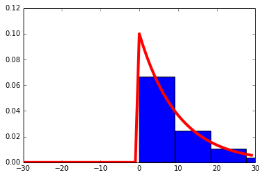


### 3.5.3 Define one's own probability distribution

Probability distributions can be discrete or continuous, they are subclasses of **rv_continuous** or **rv_discrete** classes.

Example: we want to define a random variable with pdf:
$$
f(x) = \frac{\lambda}{2} e^{-\lambda |x|}
$$


```python
from scipy.stats import rv_continuous
class my_distribution(rv_continuous):
    def __init__(self, my_lambda):
        rv_continuous.__init__(self)
        self.my_lambda = my_lambda
        
    def _pdf(self, x):
        return self.my_lambda / 2. * np.exp(-self.my_lambda * abs(x))

X = my_distribution(1)

sample = [X.rvs() for i in range(1000)]
plt.hist(sample, normed = 1)
plt.plot(np.arange(-10, 10, 0.1), X.pdf(np.arange(-10, 10, 0.1)), 'r-', linewidth = 4)
plt.xlim(-5, 5)
```


    (-5, 5)


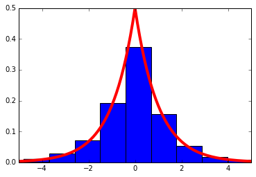


# 4. matplotlib

**matplotlib** is a plotting library in Python. Its most frequently used collection is **pyplot**.


```python
%matplotlib inline
```

## 4.1 Plot a 2d-curve

Plot $y = f(x)$ and $y = g(x)$ on the same graph.


```python
import numpy as np
import matplotlib.pyplot as plt
x = np.linspace(-10, 10, 101)
y = x**2
z = 10*abs(x)
plt.plot(x, y, 'r-', x, z, 'b-')
```


    [<matplotlib.lines.Line2D at 0x7bfbf98>,
     <matplotlib.lines.Line2D at 0x7c0a198>]


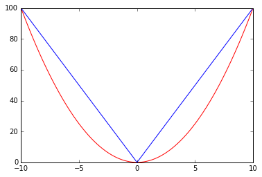


## 4.2 Customize styles

Look at <a href="https://matplotlib.org/api/_as_gen/matplotlib.pyplot.plot.html#matplotlib.pyplot.plot">this page</a> for style options.


```python
import matplotlib.pyplot as plt
x = np.linspace(-10, 10, 101)
y = x**2
z = 10*abs(x)
plt.plot(x, y, 'r--')
plt.plot(x, z, color="green", marker=".")
plt.show()
```


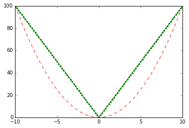


We can also limit axes, print labels and titles.


```python
import matplotlib.pyplot as plt
x = np.linspace(-10, 10, 101)
y = x**2
z = 10*abs(x)
plt.plot(x, y, 'r--', label="f(x)")
plt.plot(x, z, color="green", marker=".", label="g(x)")
plt.xlabel("x-coordinate")
plt.ylabel("y-coordinate")
plt.title("Two functions")
#plt.axis([0, 5, 0, 40])
plt.xlim(0, 5)
plt.ylim(0, 40)
#plt.legend()
plt.legend(loc='best')
```


    <matplotlib.legend.Legend at 0x99c46a0>


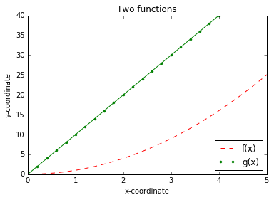


We can also define the figure size or subplot.


```python
import matplotlib.pyplot as plt

plt.figure(figsize = (16, 4))

x = np.linspace(-10, 10, 101)
y = x**2
z = 10*abs(x)

plt.subplot(131)
plt.plot(x, y, 'r--', label="f(x)")
plt.title("f(x)")
plt.axis([0, 5, 0, 40])
plt.legend()

plt.subplot(132)
plt.plot(x, z, 'g-', label="g(x)")
plt.title("g(x)")
plt.axis([0, 5, 0, 40])
plt.grid()
plt.legend()

plt.subplot(133)
plt.plot(x, z, 'g-', label="g(x)")
plt.title("g(x)")
plt.axis([0, 5, 0, 40])
plt.grid()
plt.legend()

plt.suptitle("$f(x)$ and $g(x)$", size="14")
```


    <matplotlib.text.Text at 0xac06ac8>


## 4.3 Scatter points

We can represent points in the plane by **scatter**.


```python
import random
A = [random.randint(0, 100) for i in range(100)]
B = [random.randint(0, 100) for i in range(100)]
plt.scatter(A, B, color="red", marker="o")
plt.xlim(0, 100)
plt.ylim(0, 100)
```


    (0, 100)


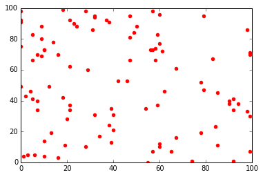


## 4.4 Different graph types

### Bar


```python
categories = {'A': 1, 'B': 2, 'C': 3, 'D': 4}
values = [20, 30, 10, 40]

colors = ["red", "green", "blue", "orange"]

plt.bar(categories.values(), values, color=colors)
#plt.xticks(categories.values(), categories.keys())
plt.xticks(np.array(categories.values()) + 0.5, categories.keys())
plt.show()
```


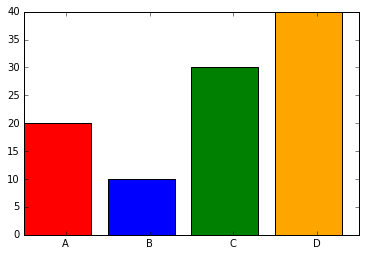


### Pie


```python
categories = {'A': 1, 'B': 2, 'C': 3, 'D': 4}
values = [20, 30, 10, 40]
colors = ["red", "green", "blue", "orange"]

plt.pie(values, labels = categories.keys(), colors = colors, startangle = 90, counterclock = False)
plt.show()
```


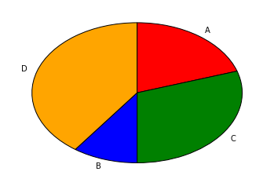


### Histogram

Histogram is useful for illustrating a random variable.


```python
mu = 0
sigma = 10

X = [random.gauss(mu, sigma) for i in range(1000)]

#plt.hist(X, facecolor='g')
#plt.ylabel('Occurence')
plt.hist(X, normed = 1, facecolor='r')
plt.yticks(np.arange(0, 0.05, 0.01), [(str(res*100) + str("%")) for res in np.arange(0, 0.05, 0.01)] )
plt.ylabel('Probability')
plt.grid()
plt.show()
```


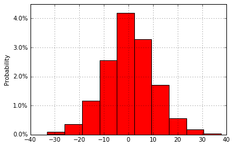


### Contour


```python
import matplotlib.pyplot as plt
import numpy as np

# Make data.
X = np.arange(-5, 5, 0.25)
Y = np.arange(-5, 5, 0.25)
X, Y = np.meshgrid(X, Y)
Z = X**2 + Y**2

#X^2 + Y^2 = 20

CS = plt.contour(X, Y, Z, levels=[20])
plt.clabel(CS, fontsize=10)
plt.show()
```


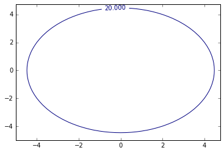


## 4.5 3d-plotting

**mplot3d** toolkit can help us plotting some 3d figures. An example:


```python
from mpl_toolkits.mplot3d import Axes3D
import matplotlib.pyplot as plt
from matplotlib import cm #For color
import numpy as np


fig = plt.figure()
ax = fig.gca(projection='3d')

# Make data.
X = np.arange(-5, 5, 0.25)
Y = np.arange(-5, 5, 0.25)
X, Y = np.meshgrid(X, Y)
Z = X**2 + Y**2

# Plot the surface.
surf = ax.plot_surface(X, Y, Z, cmap=cm.coolwarm,
                       linewidth=0, antialiased=False)

# Add a color bar which maps values to colors.
fig.colorbar(surf)

plt.show()

```


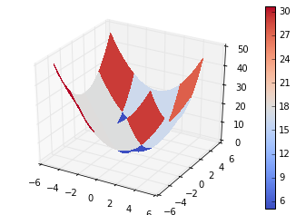


More example can be found at <a href="https://matplotlib.org/tutorials/toolkits/mplot3d.html#surface-plots"> https://matplotlib.org/tutorials/toolkits/mplot3d.html#surface-plots</a>.

# 5. urllib

**urllib** can be used to download ressources from the Internet.


```python
import urllib
mylink = "https://thethao.vnexpress.net/tin-tuc/binh-luan-u23-chau-a2018/" \
    + "hlv-uzbekistan-u23-viet-nam-da-choi-thu-bong-da-dep-mat-3704889.html"

f = urllib.urlopen(mylink)
content = f.read()

print("------------First 100 characters: --------------")
print(content[:100])
a = content.find("Việt Nam")
print("-------------First position of 'Việt Nam'------------")
print(a)
print("-------------100 characters from the first position of 'Việt Nam'------------")
print(content[a: a + 100])
```

    ------------First 100 characters: --------------
    <!DOCTYPE html>
    <html>
        <head>
            <meta http-equiv="X-UA-Compatible" content="IE=100" />
    -------------First position of 'Việt Nam'------------
    2449
    -------------100 characters from the first position of 'Việt Nam'------------
    Việt Nam đã chơi thứ bóng đá đẹp mắt’ - VnExpress Thể Thao">
            <meta name=
    


```python
from bs4 import BeautifulSoup 
tree = BeautifulSoup(content, "lxml")
print tree.find("div", "title_news").find("h1").contents[0].replace("\r", "").replace("\n", "").replace("\t", "")
```

    HLV Uzbekistan: ‘U23 Việt Nam đã chơi thứ bóng đá đẹp mắt’
    

# 6. pandas

**pandas** provides us efficient methods to work with data in table form. **pandas**'s basic data type is DataFrame.

## 6.1 Read data from files

If the content of some file is already in tab separated, comma separated or colon separated form, the method **read_csv** can read it efficiently.


```python
import pandas as pd
content = pd.read_csv("QCM.csv", sep = '\t', header = None)
print(type(content))
```

    <class 'pandas.core.frame.DataFrame'>
    

**head** or **tail** help us verify the beginning and end of the file.


```python
content.head()
```


<div>
<table border="1" class="dataframe">
  <thead>
    <tr style="text-align: right;">
      <th></th>
      <th>0</th>
      <th>1</th>
      <th>2</th>
      <th>3</th>
      <th>4</th>
      <th>5</th>
      <th>6</th>
      <th>7</th>
      <th>8</th>
      <th>9</th>
      <th>10</th>
      <th>11</th>
    </tr>
  </thead>
  <tbody>
    <tr>
      <th>0</th>
      <td>TG</td>
      <td>1</td>
      <td>1</td>
      <td>Người tối cổ xuất hiện trên Trái Đất vào niên ...</td>
      <td>2.000.000.000 năm trước</td>
      <td>80.000.000 năm trước</td>
      <td>6.000.000 năm trước</td>
      <td>400.000 năm trước</td>
      <td>C</td>
      <td>M</td>
      <td>-</td>
      <td>-</td>
    </tr>
    <tr>
      <th>1</th>
      <td>TG</td>
      <td>1</td>
      <td>2</td>
      <td>Đâu trong các sự kiện dưới đây đánh dấu bước n...</td>
      <td>biết chế tạo công cụ sản xuất</td>
      <td>biết sử dụng công cụ sản xuất</td>
      <td>biết hái lượm và săn bắt</td>
      <td>sống thành bầy đàn theo quan hệ huyết thống</td>
      <td>A</td>
      <td>M</td>
      <td>-</td>
      <td>-</td>
    </tr>
    <tr>
      <th>2</th>
      <td>TG</td>
      <td>1</td>
      <td>3</td>
      <td>Đâu trong các dòng dưới đây không phải là mục ...</td>
      <td>sưởi ấm</td>
      <td>nướng thức ăn</td>
      <td>xua thú dữ</td>
      <td>luyện kim</td>
      <td>D</td>
      <td>E</td>
      <td>-</td>
      <td>-</td>
    </tr>
    <tr>
      <th>3</th>
      <td>TG</td>
      <td>1</td>
      <td>4</td>
      <td>Thành Khang chi trị là cụm từ mô tả sự thịnh v...</td>
      <td>Thương</td>
      <td>Chu</td>
      <td>Đường</td>
      <td>Tống</td>
      <td>B</td>
      <td>H</td>
      <td>-</td>
      <td>-</td>
    </tr>
    <tr>
      <th>4</th>
      <td>TG</td>
      <td>1</td>
      <td>5</td>
      <td>Mâu thuẫn cơ bản về giai cấp trong thời kì cổ ...</td>
      <td>Chủ nô và nô lệ</td>
      <td>Lãnh chúa và nông nô</td>
      <td>Quý tộc và bình dân</td>
      <td>Tôn giáo và phi tôn giáo</td>
      <td>A</td>
      <td>E</td>
      <td>-</td>
      <td>-</td>
    </tr>
  </tbody>
</table>
</div>


```python
content.tail()
```


<div>
<table border="1" class="dataframe">
  <thead>
    <tr style="text-align: right;">
      <th></th>
      <th>0</th>
      <th>1</th>
      <th>2</th>
      <th>3</th>
      <th>4</th>
      <th>5</th>
      <th>6</th>
      <th>7</th>
      <th>8</th>
      <th>9</th>
      <th>10</th>
      <th>11</th>
    </tr>
  </thead>
  <tbody>
    <tr>
      <th>72</th>
      <td>VN</td>
      <td>2</td>
      <td>73</td>
      <td>Trong 4 công trình dưới đây ("An Nam tứ đại kh...</td>
      <td>Tượng Phật chùa Quỳnh Lâm</td>
      <td>Vạc Phổ Minh</td>
      <td>Tháp Báo Thiên</td>
      <td>Chuông Quy Điền</td>
      <td>B</td>
      <td>H</td>
      <td>-</td>
      <td>-</td>
    </tr>
    <tr>
      <th>73</th>
      <td>VN</td>
      <td>2</td>
      <td>74</td>
      <td>Thái sư Lê Văn Thịnh thời Lý đã dùng tài ngoại...</td>
      <td>Hà Giang, Lào Cai</td>
      <td>Điện Biên, Lào Cai</td>
      <td>Cao Bằng, Lạng Sơn</td>
      <td>Tuyên Quang, Thái Nguyên</td>
      <td>C</td>
      <td>H</td>
      <td>-</td>
      <td>-</td>
    </tr>
    <tr>
      <th>74</th>
      <td>VN</td>
      <td>2</td>
      <td>75</td>
      <td>Thời Lý, Đại Việt không có chiến tranh với quố...</td>
      <td>Trảo Oa</td>
      <td>Chân Lạp</td>
      <td>Đại Lý</td>
      <td>Chiêm Thành</td>
      <td>A</td>
      <td>H</td>
      <td>-</td>
      <td>-</td>
    </tr>
    <tr>
      <th>75</th>
      <td>VN</td>
      <td>3</td>
      <td>76</td>
      <td>Tứ nguyệt tam vương là cụm từ mô tả sự lên ngô...</td>
      <td>Dục Đức, Hiệp Hoà, Kiến Phúc</td>
      <td>Hiệp Hoà, Kiến Phúc, Hàm Nghi</td>
      <td>Kiến Phúc, Hàm Nghi, Đồng Khánh</td>
      <td>Hàm Nghi, Đồng Khánh, Thành Thái</td>
      <td>A</td>
      <td>H</td>
      <td>-</td>
      <td>-</td>
    </tr>
    <tr>
      <th>76</th>
      <td>VN</td>
      <td>3</td>
      <td>77</td>
      <td>Năm 1866, "không tốn một viên đạn", thực dân P...</td>
      <td>Gia Định, Định Tường, Biên Hoà</td>
      <td>Nam Định, Hà Nam, Kinh Bắc</td>
      <td>Thanh Hoá, Nghệ An, Hà Tĩnh</td>
      <td>Vĩnh Long, An Giang, Hà Tiên</td>
      <td>D</td>
      <td>H</td>
      <td>-</td>
      <td>-</td>
    </tr>
  </tbody>
</table>
</div>


We can also rename the column header.


```python
content = pd.read_csv("QCM.csv", sep = '\t', names = ["Zone", "Period", "Index", "Content", \
                                                       "Option A", "Option B", "Option C", "Option D", \
                                                       "Correction", "Level", "Tags", "Explanation"], )
content["Option A"]
#content[4] #If not named
```


    0                               2.000.000.000 năm trước
    1                         biết chế tạo công cụ sản xuất
    2                                               sưởi ấm
    3                                                Thương
    4                                       Chủ nô và nô lệ
    5                     Do Thái giáo, Kitô giáo, Hồi giáo
    6                                     Quintus Sertorius
    7                                                 César
    8                                                 César
    9               Cổ vương quốc (thế kỉ XXVII - XXII TCN)
    10                              Tề, Tấn, Tống, Tần, Ngô
    11                                     Triệu, Nguỵ, Yên
    12                                              Tây Chu
    13                        Chu (thế kỉ XI TCN - III TCN)
    14                          Thời Chu, quân Khuyển Nhung
    15                                       Thế kỉ I - III
    16                                                  Hán
    17                                            Charles I
    18                                    Phá ngục Bastille
    19                                                   13
    20                                 Thái Bình Thiên quốc
    21                                   Núi Đọ (Thanh Hoá)
    22                                             5 thế kỉ
    23                                  Phong Châu, Phú Thọ
    24                             Mê Linh, Luy Lâu, Cổ Loa
    25                   Đinh Kiến, Lý Tự Tiên (thế kỉ VII)
    26                              Hoằng Thao (Hoằng Tháo)
    27                                             Văn Lang
    28                                             Văn Lang
    29                                  Phong Châu, Phú Thọ
                                ...                        
    47                                                   50
    48                                               Âu Lạc
    49                                              Đầm Dơi
    50                                     An Nam đô hộ phủ
    51                                      Hồ Nguyên Trừng
    52                                Lê Hoàn, Lê Long Việt
    53            Lê Nhân Tông, Lê Thánh Tông, Lê Hiến Tông
    54                                       Trần Nhân Tông
    55                                  Lý Thần Tông (1135)
    56                                           Lý Thái Tổ
    57                     Nhà Lý (do Lý Thái Tổ thành lập)
    58                                         Mạc Đĩnh Chi
    59                                             Mãn Giác
    60                                                 1009
    61                                         Lý Thái Tông
    62                            Ban hành bộ luật Hình Thư
    63                                            Bạch Đằng
    64                                         Hầu Nhân Bảo
    65                                         Lý Nhân Tông
    66    Lý Nhân Tông, Lý Thần Tông, Lý Anh Tông, Lý Ch...
    67    Nhiều người lấy cớ "Phù Lý diệt Trần" nổi dậy ...
    68                                              Phạm Du
    69                                             Nho giáo
    70                                              Lộ, phủ
    71                                                 Đinh
    72                            Tượng Phật chùa Quỳnh Lâm
    73                                    Hà Giang, Lào Cai
    74                                              Trảo Oa
    75                         Dục Đức, Hiệp Hoà, Kiến Phúc
    76                       Gia Định, Định Tường, Biên Hoà
    Name: Option A, dtype: object


In case column names are not specified, we can access to columns by index.


```python
content = pd.read_csv("QCM.csv", sep = '\t', header = None)
content[4]
```


    0                               2.000.000.000 năm trước
    1                         biết chế tạo công cụ sản xuất
    2                                               sưởi ấm
    3                                                Thương
    4                                       Chủ nô và nô lệ
    5                     Do Thái giáo, Kitô giáo, Hồi giáo
    6                                     Quintus Sertorius
    7                                                 César
    8                                                 César
    9               Cổ vương quốc (thế kỉ XXVII - XXII TCN)
    10                              Tề, Tấn, Tống, Tần, Ngô
    11                                     Triệu, Nguỵ, Yên
    12                                              Tây Chu
    13                        Chu (thế kỉ XI TCN - III TCN)
    14                          Thời Chu, quân Khuyển Nhung
    15                                       Thế kỉ I - III
    16                                                  Hán
    17                                            Charles I
    18                                    Phá ngục Bastille
    19                                                   13
    20                                 Thái Bình Thiên quốc
    21                                   Núi Đọ (Thanh Hoá)
    22                                             5 thế kỉ
    23                                  Phong Châu, Phú Thọ
    24                             Mê Linh, Luy Lâu, Cổ Loa
    25                   Đinh Kiến, Lý Tự Tiên (thế kỉ VII)
    26                              Hoằng Thao (Hoằng Tháo)
    27                                             Văn Lang
    28                                             Văn Lang
    29                                  Phong Châu, Phú Thọ
                                ...                        
    47                                                   50
    48                                               Âu Lạc
    49                                              Đầm Dơi
    50                                     An Nam đô hộ phủ
    51                                      Hồ Nguyên Trừng
    52                                Lê Hoàn, Lê Long Việt
    53            Lê Nhân Tông, Lê Thánh Tông, Lê Hiến Tông
    54                                       Trần Nhân Tông
    55                                  Lý Thần Tông (1135)
    56                                           Lý Thái Tổ
    57                     Nhà Lý (do Lý Thái Tổ thành lập)
    58                                         Mạc Đĩnh Chi
    59                                             Mãn Giác
    60                                                 1009
    61                                         Lý Thái Tông
    62                            Ban hành bộ luật Hình Thư
    63                                            Bạch Đằng
    64                                         Hầu Nhân Bảo
    65                                         Lý Nhân Tông
    66    Lý Nhân Tông, Lý Thần Tông, Lý Anh Tông, Lý Ch...
    67    Nhiều người lấy cớ "Phù Lý diệt Trần" nổi dậy ...
    68                                              Phạm Du
    69                                             Nho giáo
    70                                              Lộ, phủ
    71                                                 Đinh
    72                            Tượng Phật chùa Quỳnh Lâm
    73                                    Hà Giang, Lào Cai
    74                                              Trảo Oa
    75                         Dục Đức, Hiệp Hoà, Kiến Phúc
    76                       Gia Định, Định Tường, Biên Hoà
    Name: 4, dtype: object


Such a column is of type **Series**


```python
type(content[4])
```


    pandas.core.series.Series


## 6.2 View rows, columns, cells

In a DataFrame, a row is called an index. We can list all rows, columns, cells:


```python
content.index
```

    RangeIndex(start=0, stop=77, step=1)
    


```python
content.columns
```


    Index([u'Zone', u'Period', u'Index', u'Content', u'Option A', u'Option B',
           u'Option C', u'Option D', u'Correction', u'Level', u'Tags',
           u'Explanation'],
          dtype='object')


```python
print(type(content.values))
content.values[0]
```

    <type 'numpy.ndarray'>
    


    array(['TG', 1L, 1L,
           'Ng\xc6\xb0\xe1\xbb\x9di t\xe1\xbb\x91i c\xe1\xbb\x95 xu\xe1\xba\xa5t hi\xe1\xbb\x87n tr\xc3\xaan Tr\xc3\xa1i \xc4\x90\xe1\xba\xa5t v\xc3\xa0o ni\xc3\xaan \xc4\x91\xe1\xba\xa1i n\xc3\xa0o?',
           '2.000.000.000 n\xc4\x83m tr\xc6\xb0\xe1\xbb\x9bc',
           '80.000.000 n\xc4\x83m tr\xc6\xb0\xe1\xbb\x9bc',
           '6.000.000 n\xc4\x83m tr\xc6\xb0\xe1\xbb\x9bc',
           '400.000 n\xc4\x83m tr\xc6\xb0\xe1\xbb\x9bc', 'C', 'M', '-', '-'], dtype=object)


We can also have an overview about the data, transposing the data or sort by row or column


```python
content.describe()
```


<div>
<table border="1" class="dataframe">
  <thead>
    <tr style="text-align: right;">
      <th></th>
      <th>Period</th>
      <th>Index</th>
    </tr>
  </thead>
  <tbody>
    <tr>
      <th>count</th>
      <td>77.000000</td>
      <td>77.000000</td>
    </tr>
    <tr>
      <th>mean</th>
      <td>1.519481</td>
      <td>39.000000</td>
    </tr>
    <tr>
      <th>std</th>
      <td>0.640937</td>
      <td>22.371857</td>
    </tr>
    <tr>
      <th>min</th>
      <td>1.000000</td>
      <td>1.000000</td>
    </tr>
    <tr>
      <th>25%</th>
      <td>1.000000</td>
      <td>20.000000</td>
    </tr>
    <tr>
      <th>50%</th>
      <td>1.000000</td>
      <td>39.000000</td>
    </tr>
    <tr>
      <th>75%</th>
      <td>2.000000</td>
      <td>58.000000</td>
    </tr>
    <tr>
      <th>max</th>
      <td>3.000000</td>
      <td>77.000000</td>
    </tr>
  </tbody>
</table>
</div>


```python
A = content.T
A.head()
```


<div>
<table border="1" class="dataframe">
  <thead>
    <tr style="text-align: right;">
      <th></th>
      <th>0</th>
      <th>1</th>
      <th>2</th>
      <th>3</th>
      <th>4</th>
      <th>5</th>
      <th>6</th>
      <th>7</th>
      <th>8</th>
      <th>9</th>
      <th>...</th>
      <th>67</th>
      <th>68</th>
      <th>69</th>
      <th>70</th>
      <th>71</th>
      <th>72</th>
      <th>73</th>
      <th>74</th>
      <th>75</th>
      <th>76</th>
    </tr>
  </thead>
  <tbody>
    <tr>
      <th>Zone</th>
      <td>TG</td>
      <td>TG</td>
      <td>TG</td>
      <td>TG</td>
      <td>TG</td>
      <td>TG</td>
      <td>TG</td>
      <td>TG</td>
      <td>TG</td>
      <td>TG</td>
      <td>...</td>
      <td>VN</td>
      <td>VN</td>
      <td>VN</td>
      <td>VN</td>
      <td>VN</td>
      <td>VN</td>
      <td>VN</td>
      <td>VN</td>
      <td>VN</td>
      <td>VN</td>
    </tr>
    <tr>
      <th>Period</th>
      <td>1</td>
      <td>1</td>
      <td>1</td>
      <td>1</td>
      <td>1</td>
      <td>1</td>
      <td>1</td>
      <td>1</td>
      <td>1</td>
      <td>1</td>
      <td>...</td>
      <td>2</td>
      <td>2</td>
      <td>2</td>
      <td>2</td>
      <td>2</td>
      <td>2</td>
      <td>2</td>
      <td>2</td>
      <td>3</td>
      <td>3</td>
    </tr>
    <tr>
      <th>Index</th>
      <td>1</td>
      <td>2</td>
      <td>3</td>
      <td>4</td>
      <td>5</td>
      <td>6</td>
      <td>7</td>
      <td>8</td>
      <td>9</td>
      <td>10</td>
      <td>...</td>
      <td>68</td>
      <td>69</td>
      <td>70</td>
      <td>71</td>
      <td>72</td>
      <td>73</td>
      <td>74</td>
      <td>75</td>
      <td>76</td>
      <td>77</td>
    </tr>
    <tr>
      <th>Content</th>
      <td>Người tối cổ xuất hiện trên Trái Đất vào niên ...</td>
      <td>Đâu trong các sự kiện dưới đây đánh dấu bước n...</td>
      <td>Đâu trong các dòng dưới đây không phải là mục ...</td>
      <td>Thành Khang chi trị là cụm từ mô tả sự thịnh v...</td>
      <td>Mâu thuẫn cơ bản về giai cấp trong thời kì cổ ...</td>
      <td>Dòng nào dưới đây nêu đúng thứ tự xuất hiện củ...</td>
      <td>Chiến tranh nô lệ lần thứ ba (73TCN - 71TCN), ...</td>
      <td>Nội chiến do ai chỉ huy đã làm diệt vong chế đ...</td>
      <td>Ai là hoàng đế đầu tiên của đế chế Rôma?</td>
      <td>Kim tự tháp Giza được xây dựng ở thời kì nào c...</td>
      <td>...</td>
      <td>Đầu thời Trần, triều đình lấy nguyên do nào để...</td>
      <td>Bạo loạn do ai gây ra thời Lý Cao Tông khiến L...</td>
      <td>Quốc giáo của Việt Nam thời Lý là tôn giáo nào?</td>
      <td>Nhà Lý chia cả nước thành 24 đơn vị hành chính...</td>
      <td>Việc vua đích thân cày ruộng tịch điền ở nước ...</td>
      <td>Trong 4 công trình dưới đây ("An Nam tứ đại kh...</td>
      <td>Thái sư Lê Văn Thịnh thời Lý đã dùng tài ngoại...</td>
      <td>Thời Lý, Đại Việt không có chiến tranh với quố...</td>
      <td>Tứ nguyệt tam vương là cụm từ mô tả sự lên ngô...</td>
      <td>Năm 1866, "không tốn một viên đạn", thực dân P...</td>
    </tr>
    <tr>
      <th>Option A</th>
      <td>2.000.000.000 năm trước</td>
      <td>biết chế tạo công cụ sản xuất</td>
      <td>sưởi ấm</td>
      <td>Thương</td>
      <td>Chủ nô và nô lệ</td>
      <td>Do Thái giáo, Kitô giáo, Hồi giáo</td>
      <td>Quintus Sertorius</td>
      <td>César</td>
      <td>César</td>
      <td>Cổ vương quốc (thế kỉ XXVII - XXII TCN)</td>
      <td>...</td>
      <td>Nhiều người lấy cớ "Phù Lý diệt Trần" nổi dậy ...</td>
      <td>Phạm Du</td>
      <td>Nho giáo</td>
      <td>Lộ, phủ</td>
      <td>Đinh</td>
      <td>Tượng Phật chùa Quỳnh Lâm</td>
      <td>Hà Giang, Lào Cai</td>
      <td>Trảo Oa</td>
      <td>Dục Đức, Hiệp Hoà, Kiến Phúc</td>
      <td>Gia Định, Định Tường, Biên Hoà</td>
    </tr>
  </tbody>
</table>
<p>5 rows × 77 columns</p>
</div>


```python
A = content.sort_index(axis = 1)
A.head()
```


<div>
<table border="1" class="dataframe">
  <thead>
    <tr style="text-align: right;">
      <th></th>
      <th>Content</th>
      <th>Correction</th>
      <th>Explanation</th>
      <th>Index</th>
      <th>Level</th>
      <th>Option A</th>
      <th>Option B</th>
      <th>Option C</th>
      <th>Option D</th>
      <th>Period</th>
      <th>Tags</th>
      <th>Zone</th>
    </tr>
  </thead>
  <tbody>
    <tr>
      <th>0</th>
      <td>Người tối cổ xuất hiện trên Trái Đất vào niên ...</td>
      <td>C</td>
      <td>-</td>
      <td>1</td>
      <td>M</td>
      <td>2.000.000.000 năm trước</td>
      <td>80.000.000 năm trước</td>
      <td>6.000.000 năm trước</td>
      <td>400.000 năm trước</td>
      <td>1</td>
      <td>-</td>
      <td>TG</td>
    </tr>
    <tr>
      <th>1</th>
      <td>Đâu trong các sự kiện dưới đây đánh dấu bước n...</td>
      <td>A</td>
      <td>-</td>
      <td>2</td>
      <td>M</td>
      <td>biết chế tạo công cụ sản xuất</td>
      <td>biết sử dụng công cụ sản xuất</td>
      <td>biết hái lượm và săn bắt</td>
      <td>sống thành bầy đàn theo quan hệ huyết thống</td>
      <td>1</td>
      <td>-</td>
      <td>TG</td>
    </tr>
    <tr>
      <th>2</th>
      <td>Đâu trong các dòng dưới đây không phải là mục ...</td>
      <td>D</td>
      <td>-</td>
      <td>3</td>
      <td>E</td>
      <td>sưởi ấm</td>
      <td>nướng thức ăn</td>
      <td>xua thú dữ</td>
      <td>luyện kim</td>
      <td>1</td>
      <td>-</td>
      <td>TG</td>
    </tr>
    <tr>
      <th>3</th>
      <td>Thành Khang chi trị là cụm từ mô tả sự thịnh v...</td>
      <td>B</td>
      <td>-</td>
      <td>4</td>
      <td>H</td>
      <td>Thương</td>
      <td>Chu</td>
      <td>Đường</td>
      <td>Tống</td>
      <td>1</td>
      <td>-</td>
      <td>TG</td>
    </tr>
    <tr>
      <th>4</th>
      <td>Mâu thuẫn cơ bản về giai cấp trong thời kì cổ ...</td>
      <td>A</td>
      <td>-</td>
      <td>5</td>
      <td>E</td>
      <td>Chủ nô và nô lệ</td>
      <td>Lãnh chúa và nông nô</td>
      <td>Quý tộc và bình dân</td>
      <td>Tôn giáo và phi tôn giáo</td>
      <td>1</td>
      <td>-</td>
      <td>TG</td>
    </tr>
  </tbody>
</table>
</div>


```python
A = content.sort_values(by='Level')
A.tail()
```


<div>
<table border="1" class="dataframe">
  <thead>
    <tr style="text-align: right;">
      <th></th>
      <th>Zone</th>
      <th>Period</th>
      <th>Index</th>
      <th>Content</th>
      <th>Option A</th>
      <th>Option B</th>
      <th>Option C</th>
      <th>Option D</th>
      <th>Correction</th>
      <th>Level</th>
      <th>Tags</th>
      <th>Explanation</th>
    </tr>
  </thead>
  <tbody>
    <tr>
      <th>34</th>
      <td>VN</td>
      <td>1</td>
      <td>35</td>
      <td>Thành Cổ Loa được xây hình xoắn ốc với bao nhi...</td>
      <td>1</td>
      <td>2</td>
      <td>3</td>
      <td>4</td>
      <td>C</td>
      <td>M</td>
      <td>-</td>
      <td>-</td>
    </tr>
    <tr>
      <th>42</th>
      <td>VN</td>
      <td>1</td>
      <td>43</td>
      <td>Năm 42, tướng nào của nhà Hán được phái sang đ...</td>
      <td>Mã Viện</td>
      <td>Trần Bá Tiên</td>
      <td>Lưu Hoằng Tháo</td>
      <td>Lục Dận</td>
      <td>A</td>
      <td>M</td>
      <td>-</td>
      <td>-</td>
    </tr>
    <tr>
      <th>35</th>
      <td>VN</td>
      <td>1</td>
      <td>36</td>
      <td>Nước ta thời Hùng Vương được chia thành bao nh...</td>
      <td>8</td>
      <td>15</td>
      <td>24</td>
      <td>35</td>
      <td>B</td>
      <td>M</td>
      <td>-</td>
      <td>-</td>
    </tr>
    <tr>
      <th>12</th>
      <td>TG</td>
      <td>1</td>
      <td>13</td>
      <td>Xuân Thu và Chiến Quốc là hai giai đoạn của th...</td>
      <td>Tây Chu</td>
      <td>Đông Chu</td>
      <td>Tây Hán</td>
      <td>Đông Hán</td>
      <td>B</td>
      <td>M</td>
      <td>-</td>
      <td>-</td>
    </tr>
    <tr>
      <th>0</th>
      <td>TG</td>
      <td>1</td>
      <td>1</td>
      <td>Người tối cổ xuất hiện trên Trái Đất vào niên ...</td>
      <td>2.000.000.000 năm trước</td>
      <td>80.000.000 năm trước</td>
      <td>6.000.000 năm trước</td>
      <td>400.000 năm trước</td>
      <td>C</td>
      <td>M</td>
      <td>-</td>
      <td>-</td>
    </tr>
  </tbody>
</table>
</div>


## 6.3 Get several columns, rows

We can get a sub DataFrame composed of some columns or some rows by using column names and/or index number.


```python
A = content[["Option A", "Option B", "Option C", "Option D"]]
print(type(A))
A.head()
```

    <class 'pandas.core.frame.DataFrame'>
    


<div>
<table border="1" class="dataframe">
  <thead>
    <tr style="text-align: right;">
      <th></th>
      <th>Option A</th>
      <th>Option B</th>
      <th>Option C</th>
      <th>Option D</th>
    </tr>
  </thead>
  <tbody>
    <tr>
      <th>0</th>
      <td>2.000.000.000 năm trước</td>
      <td>80.000.000 năm trước</td>
      <td>6.000.000 năm trước</td>
      <td>400.000 năm trước</td>
    </tr>
    <tr>
      <th>1</th>
      <td>biết chế tạo công cụ sản xuất</td>
      <td>biết sử dụng công cụ sản xuất</td>
      <td>biết hái lượm và săn bắt</td>
      <td>sống thành bầy đàn theo quan hệ huyết thống</td>
    </tr>
    <tr>
      <th>2</th>
      <td>sưởi ấm</td>
      <td>nướng thức ăn</td>
      <td>xua thú dữ</td>
      <td>luyện kim</td>
    </tr>
    <tr>
      <th>3</th>
      <td>Thương</td>
      <td>Chu</td>
      <td>Đường</td>
      <td>Tống</td>
    </tr>
    <tr>
      <th>4</th>
      <td>Chủ nô và nô lệ</td>
      <td>Lãnh chúa và nông nô</td>
      <td>Quý tộc và bình dân</td>
      <td>Tôn giáo và phi tôn giáo</td>
    </tr>
  </tbody>
</table>
</div>


```python
A = content[10:14]
A
```


<div>
<table border="1" class="dataframe">
  <thead>
    <tr style="text-align: right;">
      <th></th>
      <th>Zone</th>
      <th>Period</th>
      <th>Index</th>
      <th>Content</th>
      <th>Option A</th>
      <th>Option B</th>
      <th>Option C</th>
      <th>Option D</th>
      <th>Correction</th>
      <th>Level</th>
      <th>Tags</th>
      <th>Explanation</th>
    </tr>
  </thead>
  <tbody>
    <tr>
      <th>10</th>
      <td>TG</td>
      <td>1</td>
      <td>11</td>
      <td>Ngũ bá thời Xuân Thu theo Sử kí của Tư Mã Thiê...</td>
      <td>Tề, Tấn, Tống, Tần, Ngô</td>
      <td>Tề, Tấn, Ngô, Việt, Sở</td>
      <td>Tề, Tống, Ngô, Việt, Sở</td>
      <td>Tề, Tấn, Tống, Tần, Sở</td>
      <td>D</td>
      <td>H</td>
      <td>-</td>
      <td>-</td>
    </tr>
    <tr>
      <th>11</th>
      <td>TG</td>
      <td>1</td>
      <td>12</td>
      <td>Một trong những sự kiện đánh dấu sự chuyển thờ...</td>
      <td>Triệu, Nguỵ, Yên</td>
      <td>Yên, Nguỵ, Hàn</td>
      <td>Triệu, Nguỵ, Hàn</td>
      <td>Yên, Hàn, Triệu</td>
      <td>C</td>
      <td>H</td>
      <td>-</td>
      <td>-</td>
    </tr>
    <tr>
      <th>12</th>
      <td>TG</td>
      <td>1</td>
      <td>13</td>
      <td>Xuân Thu và Chiến Quốc là hai giai đoạn của th...</td>
      <td>Tây Chu</td>
      <td>Đông Chu</td>
      <td>Tây Hán</td>
      <td>Đông Hán</td>
      <td>B</td>
      <td>M</td>
      <td>-</td>
      <td>-</td>
    </tr>
    <tr>
      <th>13</th>
      <td>TG</td>
      <td>2</td>
      <td>14</td>
      <td>Văn Cảnh chi trị là cụm từ mô tả sự cai trị củ...</td>
      <td>Chu (thế kỉ XI TCN - III TCN)</td>
      <td>Tây Hán (thế kỉ II TCN - I)</td>
      <td>Đông Hán (thế kỉ I - III)</td>
      <td>Đường (thế kỉ VII - X)</td>
      <td>B</td>
      <td>H</td>
      <td>-</td>
      <td>-</td>
    </tr>
  </tbody>
</table>
</div>


```python
A = content[10:14][["Option A", "Option B", "Option C", "Option D"]]
A
```


<div>
<table border="1" class="dataframe">
  <thead>
    <tr style="text-align: right;">
      <th></th>
      <th>Option A</th>
      <th>Option B</th>
      <th>Option C</th>
      <th>Option D</th>
    </tr>
  </thead>
  <tbody>
    <tr>
      <th>10</th>
      <td>Tề, Tấn, Tống, Tần, Ngô</td>
      <td>Tề, Tấn, Ngô, Việt, Sở</td>
      <td>Tề, Tống, Ngô, Việt, Sở</td>
      <td>Tề, Tấn, Tống, Tần, Sở</td>
    </tr>
    <tr>
      <th>11</th>
      <td>Triệu, Nguỵ, Yên</td>
      <td>Yên, Nguỵ, Hàn</td>
      <td>Triệu, Nguỵ, Hàn</td>
      <td>Yên, Hàn, Triệu</td>
    </tr>
    <tr>
      <th>12</th>
      <td>Tây Chu</td>
      <td>Đông Chu</td>
      <td>Tây Hán</td>
      <td>Đông Hán</td>
    </tr>
    <tr>
      <th>13</th>
      <td>Chu (thế kỉ XI TCN - III TCN)</td>
      <td>Tây Hán (thế kỉ II TCN - I)</td>
      <td>Đông Hán (thế kỉ I - III)</td>
      <td>Đường (thế kỉ VII - X)</td>
    </tr>
  </tbody>
</table>
</div>


An equivalent way:


```python
A = content.loc[[10], ["Option A", "Option B", "Option C", "Option D"]]
A
```


<div>
<table border="1" class="dataframe">
  <thead>
    <tr style="text-align: right;">
      <th></th>
      <th>Option A</th>
      <th>Option B</th>
      <th>Option C</th>
      <th>Option D</th>
    </tr>
  </thead>
  <tbody>
    <tr>
      <th>10</th>
      <td>Tề, Tấn, Tống, Tần, Ngô</td>
      <td>Tề, Tấn, Ngô, Việt, Sở</td>
      <td>Tề, Tống, Ngô, Việt, Sở</td>
      <td>Tề, Tấn, Tống, Tần, Sở</td>
    </tr>
  </tbody>
</table>
</div>


Or using position of columns


```python
A = content.iloc[10: 14, 4: 8]
A
```


<div>
<table border="1" class="dataframe">
  <thead>
    <tr style="text-align: right;">
      <th></th>
      <th>Option A</th>
      <th>Option B</th>
      <th>Option C</th>
      <th>Option D</th>
    </tr>
  </thead>
  <tbody>
    <tr>
      <th>10</th>
      <td>Tề, Tấn, Tống, Tần, Ngô</td>
      <td>Tề, Tấn, Ngô, Việt, Sở</td>
      <td>Tề, Tống, Ngô, Việt, Sở</td>
      <td>Tề, Tấn, Tống, Tần, Sở</td>
    </tr>
    <tr>
      <th>11</th>
      <td>Triệu, Nguỵ, Yên</td>
      <td>Yên, Nguỵ, Hàn</td>
      <td>Triệu, Nguỵ, Hàn</td>
      <td>Yên, Hàn, Triệu</td>
    </tr>
    <tr>
      <th>12</th>
      <td>Tây Chu</td>
      <td>Đông Chu</td>
      <td>Tây Hán</td>
      <td>Đông Hán</td>
    </tr>
    <tr>
      <th>13</th>
      <td>Chu (thế kỉ XI TCN - III TCN)</td>
      <td>Tây Hán (thế kỉ II TCN - I)</td>
      <td>Đông Hán (thế kỉ I - III)</td>
      <td>Đường (thế kỉ VII - X)</td>
    </tr>
  </tbody>
</table>
</div>


We can also filter rows satisfying some condition (on number only).


```python
B = content[content["Period"] == 3]
B
```


<div>
<table border="1" class="dataframe">
  <thead>
    <tr style="text-align: right;">
      <th></th>
      <th>Zone</th>
      <th>Period</th>
      <th>Index</th>
      <th>Content</th>
      <th>Option A</th>
      <th>Option B</th>
      <th>Option C</th>
      <th>Option D</th>
      <th>Correction</th>
      <th>Level</th>
      <th>Tags</th>
      <th>Explanation</th>
    </tr>
  </thead>
  <tbody>
    <tr>
      <th>17</th>
      <td>TG</td>
      <td>3</td>
      <td>18</td>
      <td>Trong nội chiến ở Anh 1640-1649, vua nào bị xử...</td>
      <td>Charles I</td>
      <td>George I</td>
      <td>Harold II</td>
      <td>Erward I</td>
      <td>A</td>
      <td>H</td>
      <td>-</td>
      <td>-</td>
    </tr>
    <tr>
      <th>18</th>
      <td>TG</td>
      <td>3</td>
      <td>19</td>
      <td>Sự kiện nào dưới đây đánh dấu sự bùng nổ Cách ...</td>
      <td>Phá ngục Bastille</td>
      <td>Chiếm cung điện Versailles</td>
      <td>Xử tử vua Louis XVI</td>
      <td>Nhóm Jacobin lên nắm chính quyền</td>
      <td>A</td>
      <td>M</td>
      <td>-</td>
      <td>-</td>
    </tr>
    <tr>
      <th>19</th>
      <td>TG</td>
      <td>3</td>
      <td>20</td>
      <td>Khi thành lập Hợp chúng quốc Mỹ (1776), quốc g...</td>
      <td>13</td>
      <td>18</td>
      <td>22</td>
      <td>27</td>
      <td>A</td>
      <td>H</td>
      <td>-</td>
      <td>-</td>
    </tr>
    <tr>
      <th>20</th>
      <td>TG</td>
      <td>3</td>
      <td>21</td>
      <td>Để trấn áp phong trào nào sau đây tại Trung Qu...</td>
      <td>Thái Bình Thiên quốc</td>
      <td>Trung Quốc Đồng Minh hội</td>
      <td>Nghĩa Hoà Đoàn</td>
      <td>Cách mạng Tân Hợi</td>
      <td>C</td>
      <td>H</td>
      <td>-</td>
      <td>-</td>
    </tr>
    <tr>
      <th>75</th>
      <td>VN</td>
      <td>3</td>
      <td>76</td>
      <td>Tứ nguyệt tam vương là cụm từ mô tả sự lên ngô...</td>
      <td>Dục Đức, Hiệp Hoà, Kiến Phúc</td>
      <td>Hiệp Hoà, Kiến Phúc, Hàm Nghi</td>
      <td>Kiến Phúc, Hàm Nghi, Đồng Khánh</td>
      <td>Hàm Nghi, Đồng Khánh, Thành Thái</td>
      <td>A</td>
      <td>H</td>
      <td>-</td>
      <td>-</td>
    </tr>
    <tr>
      <th>76</th>
      <td>VN</td>
      <td>3</td>
      <td>77</td>
      <td>Năm 1866, "không tốn một viên đạn", thực dân P...</td>
      <td>Gia Định, Định Tường, Biên Hoà</td>
      <td>Nam Định, Hà Nam, Kinh Bắc</td>
      <td>Thanh Hoá, Nghệ An, Hà Tĩnh</td>
      <td>Vĩnh Long, An Giang, Hà Tiên</td>
      <td>D</td>
      <td>H</td>
      <td>-</td>
      <td>-</td>
    </tr>
  </tbody>
</table>
</div>


## 6.4 Override data

By the same way, we can override data.


```python
content_copy = pd.read_csv("QCM.csv", sep = '\t', names = ["Zone", "Period", "Index", "Content", \
                                                       "Option A", "Option B", "Option C", "Option D", \
                                                       "Correction", "Level", "Tags", "Explanation"], )
content_copy["Tags"][1:3] = '+'
content_copy.head()
```

    D:\Users\ndoannguyen\AppData\Local\Continuum\Anaconda2\lib\site-packages\ipykernel\__main__.py:2: SettingWithCopyWarning: 
    A value is trying to be set on a copy of a slice from a DataFrame
    
    See the caveats in the documentation: http://pandas.pydata.org/pandas-docs/stable/indexing.html#indexing-view-versus-copy
      from ipykernel import kernelapp as app
    


<div>
<table border="1" class="dataframe">
  <thead>
    <tr style="text-align: right;">
      <th></th>
      <th>Zone</th>
      <th>Period</th>
      <th>Index</th>
      <th>Content</th>
      <th>Option A</th>
      <th>Option B</th>
      <th>Option C</th>
      <th>Option D</th>
      <th>Correction</th>
      <th>Level</th>
      <th>Tags</th>
      <th>Explanation</th>
    </tr>
  </thead>
  <tbody>
    <tr>
      <th>0</th>
      <td>TG</td>
      <td>1</td>
      <td>1</td>
      <td>Người tối cổ xuất hiện trên Trái Đất vào niên ...</td>
      <td>2.000.000.000 năm trước</td>
      <td>80.000.000 năm trước</td>
      <td>6.000.000 năm trước</td>
      <td>400.000 năm trước</td>
      <td>C</td>
      <td>M</td>
      <td>-</td>
      <td>-</td>
    </tr>
    <tr>
      <th>1</th>
      <td>TG</td>
      <td>1</td>
      <td>2</td>
      <td>Đâu trong các sự kiện dưới đây đánh dấu bước n...</td>
      <td>biết chế tạo công cụ sản xuất</td>
      <td>biết sử dụng công cụ sản xuất</td>
      <td>biết hái lượm và săn bắt</td>
      <td>sống thành bầy đàn theo quan hệ huyết thống</td>
      <td>A</td>
      <td>M</td>
      <td>+</td>
      <td>-</td>
    </tr>
    <tr>
      <th>2</th>
      <td>TG</td>
      <td>1</td>
      <td>3</td>
      <td>Đâu trong các dòng dưới đây không phải là mục ...</td>
      <td>sưởi ấm</td>
      <td>nướng thức ăn</td>
      <td>xua thú dữ</td>
      <td>luyện kim</td>
      <td>D</td>
      <td>E</td>
      <td>+</td>
      <td>-</td>
    </tr>
    <tr>
      <th>3</th>
      <td>TG</td>
      <td>1</td>
      <td>4</td>
      <td>Thành Khang chi trị là cụm từ mô tả sự thịnh v...</td>
      <td>Thương</td>
      <td>Chu</td>
      <td>Đường</td>
      <td>Tống</td>
      <td>B</td>
      <td>H</td>
      <td>-</td>
      <td>-</td>
    </tr>
    <tr>
      <th>4</th>
      <td>TG</td>
      <td>1</td>
      <td>5</td>
      <td>Mâu thuẫn cơ bản về giai cấp trong thời kì cổ ...</td>
      <td>Chủ nô và nô lệ</td>
      <td>Lãnh chúa và nông nô</td>
      <td>Quý tộc và bình dân</td>
      <td>Tôn giáo và phi tôn giáo</td>
      <td>A</td>
      <td>E</td>
      <td>-</td>
      <td>-</td>
    </tr>
  </tbody>
</table>
</div>


```python
content_copy.iloc[1:3, 4:8] = ""
content_copy.head()
```


<div>
<table border="1" class="dataframe">
  <thead>
    <tr style="text-align: right;">
      <th></th>
      <th>Zone</th>
      <th>Period</th>
      <th>Index</th>
      <th>Content</th>
      <th>Option A</th>
      <th>Option B</th>
      <th>Option C</th>
      <th>Option D</th>
      <th>Correction</th>
      <th>Level</th>
      <th>Tags</th>
      <th>Explanation</th>
    </tr>
  </thead>
  <tbody>
    <tr>
      <th>0</th>
      <td>TG</td>
      <td>1</td>
      <td>1</td>
      <td>Người tối cổ xuất hiện trên Trái Đất vào niên ...</td>
      <td>2.000.000.000 năm trước</td>
      <td>80.000.000 năm trước</td>
      <td>6.000.000 năm trước</td>
      <td>400.000 năm trước</td>
      <td>C</td>
      <td>M</td>
      <td>+</td>
      <td>-</td>
    </tr>
    <tr>
      <th>1</th>
      <td>TG</td>
      <td>1</td>
      <td>2</td>
      <td>Đâu trong các sự kiện dưới đây đánh dấu bước n...</td>
      <td></td>
      <td></td>
      <td></td>
      <td></td>
      <td>A</td>
      <td>M</td>
      <td>+</td>
      <td>-</td>
    </tr>
    <tr>
      <th>2</th>
      <td>TG</td>
      <td>1</td>
      <td>3</td>
      <td>Đâu trong các dòng dưới đây không phải là mục ...</td>
      <td></td>
      <td></td>
      <td></td>
      <td></td>
      <td>D</td>
      <td>E</td>
      <td>+</td>
      <td>-</td>
    </tr>
    <tr>
      <th>3</th>
      <td>TG</td>
      <td>1</td>
      <td>4</td>
      <td>Thành Khang chi trị là cụm từ mô tả sự thịnh v...</td>
      <td>Thương</td>
      <td>Chu</td>
      <td>Đường</td>
      <td>Tống</td>
      <td>B</td>
      <td>H</td>
      <td>+</td>
      <td>-</td>
    </tr>
    <tr>
      <th>4</th>
      <td>TG</td>
      <td>1</td>
      <td>5</td>
      <td>Mâu thuẫn cơ bản về giai cấp trong thời kì cổ ...</td>
      <td>Chủ nô và nô lệ</td>
      <td>Lãnh chúa và nông nô</td>
      <td>Quý tộc và bình dân</td>
      <td>Tôn giáo và phi tôn giáo</td>
      <td>A</td>
      <td>E</td>
      <td>+</td>
      <td>-</td>
    </tr>
  </tbody>
</table>
</div>


Insert a new column


```python
content_copy = pd.read_csv("QCM.csv", sep = '\t', names = ["Zone", "Period", "Index", "Content", \
                                                       "Option A", "Option B", "Option C", "Option D", \
                                                       "Correction", "Level", "Tags", "Explanation"], )
content_copy.insert(9, "New column", "-")
content_copy.head()
```


<div>
<table border="1" class="dataframe">
  <thead>
    <tr style="text-align: right;">
      <th></th>
      <th>Zone</th>
      <th>Period</th>
      <th>Index</th>
      <th>Content</th>
      <th>Option A</th>
      <th>Option B</th>
      <th>Option C</th>
      <th>Option D</th>
      <th>Correction</th>
      <th>New column</th>
      <th>Level</th>
      <th>Tags</th>
      <th>Explanation</th>
    </tr>
  </thead>
  <tbody>
    <tr>
      <th>0</th>
      <td>TG</td>
      <td>1</td>
      <td>1</td>
      <td>Người tối cổ xuất hiện trên Trái Đất vào niên ...</td>
      <td>2.000.000.000 năm trước</td>
      <td>80.000.000 năm trước</td>
      <td>6.000.000 năm trước</td>
      <td>400.000 năm trước</td>
      <td>C</td>
      <td>-</td>
      <td>M</td>
      <td>-</td>
      <td>-</td>
    </tr>
    <tr>
      <th>1</th>
      <td>TG</td>
      <td>1</td>
      <td>2</td>
      <td>Đâu trong các sự kiện dưới đây đánh dấu bước n...</td>
      <td>biết chế tạo công cụ sản xuất</td>
      <td>biết sử dụng công cụ sản xuất</td>
      <td>biết hái lượm và săn bắt</td>
      <td>sống thành bầy đàn theo quan hệ huyết thống</td>
      <td>A</td>
      <td>-</td>
      <td>M</td>
      <td>-</td>
      <td>-</td>
    </tr>
    <tr>
      <th>2</th>
      <td>TG</td>
      <td>1</td>
      <td>3</td>
      <td>Đâu trong các dòng dưới đây không phải là mục ...</td>
      <td>sưởi ấm</td>
      <td>nướng thức ăn</td>
      <td>xua thú dữ</td>
      <td>luyện kim</td>
      <td>D</td>
      <td>-</td>
      <td>E</td>
      <td>-</td>
      <td>-</td>
    </tr>
    <tr>
      <th>3</th>
      <td>TG</td>
      <td>1</td>
      <td>4</td>
      <td>Thành Khang chi trị là cụm từ mô tả sự thịnh v...</td>
      <td>Thương</td>
      <td>Chu</td>
      <td>Đường</td>
      <td>Tống</td>
      <td>B</td>
      <td>-</td>
      <td>H</td>
      <td>-</td>
      <td>-</td>
    </tr>
    <tr>
      <th>4</th>
      <td>TG</td>
      <td>1</td>
      <td>5</td>
      <td>Mâu thuẫn cơ bản về giai cấp trong thời kì cổ ...</td>
      <td>Chủ nô và nô lệ</td>
      <td>Lãnh chúa và nông nô</td>
      <td>Quý tộc và bình dân</td>
      <td>Tôn giáo và phi tôn giáo</td>
      <td>A</td>
      <td>-</td>
      <td>E</td>
      <td>-</td>
      <td>-</td>
    </tr>
  </tbody>
</table>
</div>


Insert a new row


```python
content_copy = pd.read_csv("QCM.csv", sep = '\t', names = ["Zone", "Period", "Index", "Content", \
                                                       "Option A", "Option B", "Option C", "Option D", \
                                                       "Correction", "Level", "Tags", "Explanation"], )
A = content_copy.append(content_copy.iloc[0, :])
A.tail()
```


<div>
<table border="1" class="dataframe">
  <thead>
    <tr style="text-align: right;">
      <th></th>
      <th>Zone</th>
      <th>Period</th>
      <th>Index</th>
      <th>Content</th>
      <th>Option A</th>
      <th>Option B</th>
      <th>Option C</th>
      <th>Option D</th>
      <th>Correction</th>
      <th>Level</th>
      <th>Tags</th>
      <th>Explanation</th>
    </tr>
  </thead>
  <tbody>
    <tr>
      <th>73</th>
      <td>VN</td>
      <td>2</td>
      <td>74</td>
      <td>Thái sư Lê Văn Thịnh thời Lý đã dùng tài ngoại...</td>
      <td>Hà Giang, Lào Cai</td>
      <td>Điện Biên, Lào Cai</td>
      <td>Cao Bằng, Lạng Sơn</td>
      <td>Tuyên Quang, Thái Nguyên</td>
      <td>C</td>
      <td>H</td>
      <td>-</td>
      <td>-</td>
    </tr>
    <tr>
      <th>74</th>
      <td>VN</td>
      <td>2</td>
      <td>75</td>
      <td>Thời Lý, Đại Việt không có chiến tranh với quố...</td>
      <td>Trảo Oa</td>
      <td>Chân Lạp</td>
      <td>Đại Lý</td>
      <td>Chiêm Thành</td>
      <td>A</td>
      <td>H</td>
      <td>-</td>
      <td>-</td>
    </tr>
    <tr>
      <th>75</th>
      <td>VN</td>
      <td>3</td>
      <td>76</td>
      <td>Tứ nguyệt tam vương là cụm từ mô tả sự lên ngô...</td>
      <td>Dục Đức, Hiệp Hoà, Kiến Phúc</td>
      <td>Hiệp Hoà, Kiến Phúc, Hàm Nghi</td>
      <td>Kiến Phúc, Hàm Nghi, Đồng Khánh</td>
      <td>Hàm Nghi, Đồng Khánh, Thành Thái</td>
      <td>A</td>
      <td>H</td>
      <td>-</td>
      <td>-</td>
    </tr>
    <tr>
      <th>76</th>
      <td>VN</td>
      <td>3</td>
      <td>77</td>
      <td>Năm 1866, "không tốn một viên đạn", thực dân P...</td>
      <td>Gia Định, Định Tường, Biên Hoà</td>
      <td>Nam Định, Hà Nam, Kinh Bắc</td>
      <td>Thanh Hoá, Nghệ An, Hà Tĩnh</td>
      <td>Vĩnh Long, An Giang, Hà Tiên</td>
      <td>D</td>
      <td>H</td>
      <td>-</td>
      <td>-</td>
    </tr>
    <tr>
      <th>0</th>
      <td>TG</td>
      <td>1</td>
      <td>1</td>
      <td>Người tối cổ xuất hiện trên Trái Đất vào niên ...</td>
      <td>2.000.000.000 năm trước</td>
      <td>80.000.000 năm trước</td>
      <td>6.000.000 năm trước</td>
      <td>400.000 năm trước</td>
      <td>C</td>
      <td>M</td>
      <td>-</td>
      <td>-</td>
    </tr>
  </tbody>
</table>
</div>


Delete a column


```python
content_copy = pd.read_csv("QCM.csv", sep = '\t', names = ["Zone", "Period", "Index", "Content", \
                                                       "Option A", "Option B", "Option C", "Option D", \
                                                       "Correction", "Level", "Tags", "Explanation"], )
A = content_copy.drop(["Tags", "Level"], axis=1)
A.head()
```


<div>
<table border="1" class="dataframe">
  <thead>
    <tr style="text-align: right;">
      <th></th>
      <th>Zone</th>
      <th>Period</th>
      <th>Index</th>
      <th>Content</th>
      <th>Option A</th>
      <th>Option B</th>
      <th>Option C</th>
      <th>Option D</th>
      <th>Correction</th>
      <th>Explanation</th>
    </tr>
  </thead>
  <tbody>
    <tr>
      <th>0</th>
      <td>TG</td>
      <td>1</td>
      <td>1</td>
      <td>Người tối cổ xuất hiện trên Trái Đất vào niên ...</td>
      <td>2.000.000.000 năm trước</td>
      <td>80.000.000 năm trước</td>
      <td>6.000.000 năm trước</td>
      <td>400.000 năm trước</td>
      <td>C</td>
      <td>-</td>
    </tr>
    <tr>
      <th>1</th>
      <td>TG</td>
      <td>1</td>
      <td>2</td>
      <td>Đâu trong các sự kiện dưới đây đánh dấu bước n...</td>
      <td>biết chế tạo công cụ sản xuất</td>
      <td>biết sử dụng công cụ sản xuất</td>
      <td>biết hái lượm và săn bắt</td>
      <td>sống thành bầy đàn theo quan hệ huyết thống</td>
      <td>A</td>
      <td>-</td>
    </tr>
    <tr>
      <th>2</th>
      <td>TG</td>
      <td>1</td>
      <td>3</td>
      <td>Đâu trong các dòng dưới đây không phải là mục ...</td>
      <td>sưởi ấm</td>
      <td>nướng thức ăn</td>
      <td>xua thú dữ</td>
      <td>luyện kim</td>
      <td>D</td>
      <td>-</td>
    </tr>
    <tr>
      <th>3</th>
      <td>TG</td>
      <td>1</td>
      <td>4</td>
      <td>Thành Khang chi trị là cụm từ mô tả sự thịnh v...</td>
      <td>Thương</td>
      <td>Chu</td>
      <td>Đường</td>
      <td>Tống</td>
      <td>B</td>
      <td>-</td>
    </tr>
    <tr>
      <th>4</th>
      <td>TG</td>
      <td>1</td>
      <td>5</td>
      <td>Mâu thuẫn cơ bản về giai cấp trong thời kì cổ ...</td>
      <td>Chủ nô và nô lệ</td>
      <td>Lãnh chúa và nông nô</td>
      <td>Quý tộc và bình dân</td>
      <td>Tôn giáo và phi tôn giáo</td>
      <td>A</td>
      <td>-</td>
    </tr>
  </tbody>
</table>
</div>


Delete a row


```python
content_copy = pd.read_csv("QCM.csv", sep = '\t', names = ["Zone", "Period", "Index", "Content", \
                                                       "Option A", "Option B", "Option C", "Option D", \
                                                       "Correction", "Level", "Tags", "Explanation"], )
A = content_copy.drop(range(0, 3), axis=0)
A.head()
```


<div>
<table border="1" class="dataframe">
  <thead>
    <tr style="text-align: right;">
      <th></th>
      <th>Zone</th>
      <th>Period</th>
      <th>Index</th>
      <th>Content</th>
      <th>Option A</th>
      <th>Option B</th>
      <th>Option C</th>
      <th>Option D</th>
      <th>Correction</th>
      <th>Level</th>
      <th>Tags</th>
      <th>Explanation</th>
    </tr>
  </thead>
  <tbody>
    <tr>
      <th>3</th>
      <td>TG</td>
      <td>1</td>
      <td>4</td>
      <td>Thành Khang chi trị là cụm từ mô tả sự thịnh v...</td>
      <td>Thương</td>
      <td>Chu</td>
      <td>Đường</td>
      <td>Tống</td>
      <td>B</td>
      <td>H</td>
      <td>-</td>
      <td>-</td>
    </tr>
    <tr>
      <th>4</th>
      <td>TG</td>
      <td>1</td>
      <td>5</td>
      <td>Mâu thuẫn cơ bản về giai cấp trong thời kì cổ ...</td>
      <td>Chủ nô và nô lệ</td>
      <td>Lãnh chúa và nông nô</td>
      <td>Quý tộc và bình dân</td>
      <td>Tôn giáo và phi tôn giáo</td>
      <td>A</td>
      <td>E</td>
      <td>-</td>
      <td>-</td>
    </tr>
    <tr>
      <th>5</th>
      <td>TG</td>
      <td>1</td>
      <td>6</td>
      <td>Dòng nào dưới đây nêu đúng thứ tự xuất hiện củ...</td>
      <td>Do Thái giáo, Kitô giáo, Hồi giáo</td>
      <td>Kitô giáo, Do Thái giáo, Hồi giáo</td>
      <td>Kitô giáo, Hồi giáo, Do Thái giáo</td>
      <td>Do Thái giáo, Hồi giáo, Kitô giáo</td>
      <td>A</td>
      <td>M</td>
      <td>-</td>
      <td>-</td>
    </tr>
    <tr>
      <th>6</th>
      <td>TG</td>
      <td>1</td>
      <td>7</td>
      <td>Chiến tranh nô lệ lần thứ ba (73TCN - 71TCN), ...</td>
      <td>Quintus Sertorius</td>
      <td>Marcus Licinius Crassus</td>
      <td>Oenomaus</td>
      <td>Spartacus</td>
      <td>D</td>
      <td>M</td>
      <td>-</td>
      <td>-</td>
    </tr>
    <tr>
      <th>7</th>
      <td>TG</td>
      <td>1</td>
      <td>8</td>
      <td>Nội chiến do ai chỉ huy đã làm diệt vong chế đ...</td>
      <td>César</td>
      <td>Augustus</td>
      <td>Tiberus</td>
      <td>Nero</td>
      <td>A</td>
      <td>H</td>
      <td>-</td>
      <td>-</td>
    </tr>
  </tbody>
</table>
</div>


Concatenate rows


```python
pieces = [content_copy[0:4], content_copy[20:22]]
#content_copy.iloc[[1, 2, 20, 21], :]
pd.concat(pieces)
```


<div>
<table border="1" class="dataframe">
  <thead>
    <tr style="text-align: right;">
      <th></th>
      <th>Zone</th>
      <th>Period</th>
      <th>Index</th>
      <th>Content</th>
      <th>Option A</th>
      <th>Option B</th>
      <th>Option C</th>
      <th>Option D</th>
      <th>Correction</th>
      <th>Level</th>
      <th>Tags</th>
      <th>Explanation</th>
    </tr>
  </thead>
  <tbody>
    <tr>
      <th>0</th>
      <td>TG</td>
      <td>1</td>
      <td>1</td>
      <td>Người tối cổ xuất hiện trên Trái Đất vào niên ...</td>
      <td>2.000.000.000 năm trước</td>
      <td>80.000.000 năm trước</td>
      <td>6.000.000 năm trước</td>
      <td>400.000 năm trước</td>
      <td>C</td>
      <td>M</td>
      <td>-</td>
      <td>-</td>
    </tr>
    <tr>
      <th>1</th>
      <td>TG</td>
      <td>1</td>
      <td>2</td>
      <td>Đâu trong các sự kiện dưới đây đánh dấu bước n...</td>
      <td>biết chế tạo công cụ sản xuất</td>
      <td>biết sử dụng công cụ sản xuất</td>
      <td>biết hái lượm và săn bắt</td>
      <td>sống thành bầy đàn theo quan hệ huyết thống</td>
      <td>A</td>
      <td>M</td>
      <td>-</td>
      <td>-</td>
    </tr>
    <tr>
      <th>2</th>
      <td>TG</td>
      <td>1</td>
      <td>3</td>
      <td>Đâu trong các dòng dưới đây không phải là mục ...</td>
      <td>sưởi ấm</td>
      <td>nướng thức ăn</td>
      <td>xua thú dữ</td>
      <td>luyện kim</td>
      <td>D</td>
      <td>E</td>
      <td>-</td>
      <td>-</td>
    </tr>
    <tr>
      <th>3</th>
      <td>TG</td>
      <td>1</td>
      <td>4</td>
      <td>Thành Khang chi trị là cụm từ mô tả sự thịnh v...</td>
      <td>Thương</td>
      <td>Chu</td>
      <td>Đường</td>
      <td>Tống</td>
      <td>B</td>
      <td>H</td>
      <td>-</td>
      <td>-</td>
    </tr>
    <tr>
      <th>20</th>
      <td>TG</td>
      <td>3</td>
      <td>21</td>
      <td>Để trấn áp phong trào nào sau đây tại Trung Qu...</td>
      <td>Thái Bình Thiên quốc</td>
      <td>Trung Quốc Đồng Minh hội</td>
      <td>Nghĩa Hoà Đoàn</td>
      <td>Cách mạng Tân Hợi</td>
      <td>C</td>
      <td>H</td>
      <td>-</td>
      <td>-</td>
    </tr>
    <tr>
      <th>21</th>
      <td>VN</td>
      <td>1</td>
      <td>22</td>
      <td>Tại di chỉ nào dưới đây các nhà khảo cổ đã tìm...</td>
      <td>Núi Đọ (Thanh Hoá)</td>
      <td>Hang Thẩm Khuyên, Thẩm Hai (Lạng Sơn)</td>
      <td>Hàng Gòn, Dầu Giây (Đồng Nai)</td>
      <td>Dốc Mơ, Vườn Dũ (Sông Bé)</td>
      <td>B</td>
      <td>H</td>
      <td>-</td>
      <td>-</td>
    </tr>
  </tbody>
</table>
</div>


## 6.5 Categorical data

We can convert some columns to categorical data.


```python
content_copy["Zone"] = content_copy["Zone"].astype("category")
content_copy["Zone"]
```


    0     TG
    1     TG
    2     TG
    3     TG
    4     TG
    5     TG
    6     TG
    7     TG
    8     TG
    9     TG
    10    TG
    11    TG
    12    TG
    13    TG
    14    TG
    15    TG
    16    TG
    17    TG
    18    TG
    19    TG
    20    TG
    21    VN
    22    VN
    23    VN
    24    VN
    25    VN
    26    VN
    27    VN
    28    VN
    29    VN
          ..
    47    VN
    48    VN
    49    VN
    50    VN
    51    VN
    52    VN
    53    VN
    54    VN
    55    VN
    56    VN
    57    VN
    58    VN
    59    VN
    60    VN
    61    VN
    62    VN
    63    VN
    64    VN
    65    VN
    66    VN
    67    VN
    68    VN
    69    VN
    70    VN
    71    VN
    72    VN
    73    VN
    74    VN
    75    VN
    76    VN
    Name: Zone, dtype: category
    Categories (2, object): [TG, VN]


Then we can rename the category.


```python
content_copy["Zone"].cat.categories = ["World", "Vietnam"]
content_copy["Zone"]
```


    0       World
    1       World
    2       World
    3       World
    4       World
    5       World
    6       World
    7       World
    8       World
    9       World
    10      World
    11      World
    12      World
    13      World
    14      World
    15      World
    16      World
    17      World
    18      World
    19      World
    20      World
    21    Vietnam
    22    Vietnam
    23    Vietnam
    24    Vietnam
    25    Vietnam
    26    Vietnam
    27    Vietnam
    28    Vietnam
    29    Vietnam
           ...   
    47    Vietnam
    48    Vietnam
    49    Vietnam
    50    Vietnam
    51    Vietnam
    52    Vietnam
    53    Vietnam
    54    Vietnam
    55    Vietnam
    56    Vietnam
    57    Vietnam
    58    Vietnam
    59    Vietnam
    60    Vietnam
    61    Vietnam
    62    Vietnam
    63    Vietnam
    64    Vietnam
    65    Vietnam
    66    Vietnam
    67    Vietnam
    68    Vietnam
    69    Vietnam
    70    Vietnam
    71    Vietnam
    72    Vietnam
    73    Vietnam
    74    Vietnam
    75    Vietnam
    76    Vietnam
    Name: Zone, dtype: category
    Categories (2, object): [World, Vietnam]


## 6.6 Export to a file


```python
content_copy = pd.read_csv("QCM.csv", sep = '\t', names = ["Zone", "Period", "Index", "Content", \
                                                       "Option A", "Option B", "Option C", "Option D", \
                                                       "Correction", "Level", "Tags", "Explanation"], )
content_copy["Zone"] = content_copy["Zone"].astype("category")
content_copy["Zone"].cat.categories = ["World", "Vietnam"]
content_copy.to_csv("NewQCM.csv", sep = "\t")
```

# 7. os

**os** can be used to run operating system commands inside a Python program. For example:

**Print the current working directory**


```python
import os
os.getcwd()
```


    'd:\\Userfiles\\ndoannguyen\\Documents\\Projects\\DSC101\\Lesson3\\Amphi'


**Show contents of some directory**


```python
os.listdir('d:\\Userfiles\\ndoannguyen\\Documents\\Projects\\DSC101\\Lesson3')
```


    ['.ipynb_checkpoints', 'Amphi', 'Data2', 'TD']


**Make a new directory**


```python
os.mkdir("..\\Data")
os.listdir('d:\\Userfiles\\ndoannguyen\\Documents\\Projects\\DSC101\\Lesson3')
```


    ['.ipynb_checkpoints', 'Amphi', 'Data', 'Data2', 'TD']


**Remove an empty directory**


```python
os.rmdir("..\\Data")
os.listdir('d:\\Userfiles\\ndoannguyen\\Documents\\Projects\\DSC101\\Lesson3')
```


    ['.ipynb_checkpoints', 'Amphi', 'Data2', 'TD']


**Check if a file/directory exists**


```python
os.path.isfile("..\\Data\\file.txt")
```


    False


```python
os.path.isdir("..\\Data")
```


    True


```python
os.path.exists("..\\Data")
```


    True


**Remove files**


```python
if os.path.isfile("..\\Data\\file.txt"):
    os.remove("..\\Data\\file.txt")
```

**Rename files, folders**


```python
if os.path.exists("..\\Data"):
    os.rename("..\\Data", "..\\Data2")
os.listdir('d:\\Userfiles\\ndoannguyen\\Documents\\Projects\\DSC101\\Lesson3')
```


    ['.ipynb_checkpoints', 'Amphi', 'Data2', 'TD']


# 8. sys

A Python file can be run from the environment. It interacts with the arguments from the environment by **sys.argv**, used in the main function.


```python
#Write this in file Hello.py
import sys

if __name__ == "__main__":
    user = sys.argv[1]
    print("Hello %s!" % user)
```

    Hello -f!
    
$ python Hello.py Peter
Hello Peter!